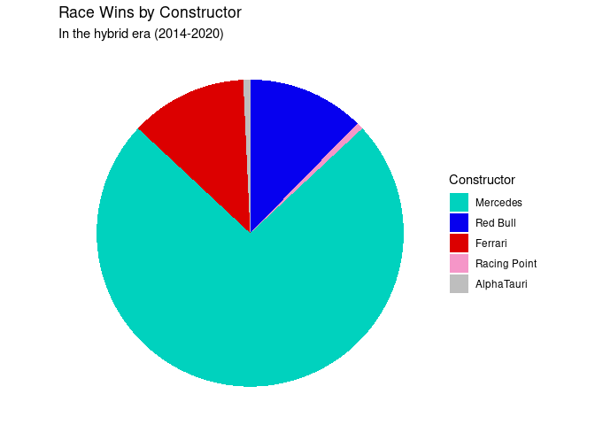

What makes a successful Formula One team?
================
by ECK

## Summary

Formula One, or F1, is the highest class of single-seater racing and one
of the most prestigious racing series around the world.

Each season around 10 constructors (also referred to as “teams”) build a
car to strict regulations and race them at more than 20 circuits across
the globe. A constructor fields two drivers and earns points towards two
separate championships; one each for the driver and constructor who
score the most points over a season.

With our project we wanted to investigate the factors that make a
successful F1 team. Is outright speed the only metric that matters? Or
do small gains made in pit stop times or reliability make all the
difference?

To answer the question “What makes a successful Formula One team?”, we
wanted to analyse how several predictor variables from our data set
impacted a team’s performance. Since our data is actually a combination
of multiple data sets, we combined the data sets *results, races,
drivers* and *constructors* and focused only on entries in the hybrid
era (2014-2020 excluding the 2021 season which is ongoing at the time of
this analysis). This resulting data set was called *f1merged_hybrid*.

In picking out a successful Formula One team from recent years there is
one obvious candidate.

<!-- -->

Mercedes-AMG Petronas F1 team have won the Drivers’ and Constructors’
championships 7 years running, with a near unprecedented level of
dominance. We looked at Mercedes specifically, as well as a comparison
group containing 4 other teams that competed against them during this
same timeframe.

Could the answer to our question simply be that Mercedes are outright
faster than their competitors? We investigated the average lap time of
each key team and found that Mercedes has only a slight advantage in
mean lap time over the likes of Ferrari and Red Bull. Is this small
advantage in race pace a significant enough difference to explain the
massive discrepancy in wins and pole positions? (1st place in
qualifying) Looking purely at median lap time, it wouldn’t be
unreasonable to expect Ferrari and Red Bull to have similarly successful
records over the same period.

Do tiny margins in terms of speed make a significant difference in F1?
We investigated whether those fractions of a second could be the
determining factor by plotting average lap time against finishing
position and plotting a line of best fit. Our visualisation found very
little correlation between a driver’s average lap time during a race and
their finishing position (shown by an almost flat regression line).
Thus, Mercedes’ overwhelming number of race wins is unlikely to be
explained be a slight advantage in race pace.

Is it possible that one particularly skilled Mercedes racer just happens
to get first place with the other Mercedes performing worse? This would
show a large number of Mercedes wins even though they would perform
worse overall as a team. We analysed this by plotting the finishing
positions of each key constructor. However, it shows that the vast
majority of Mercedes racers will finish in the top 5 with a median
finishing position of around 2. Red Bull and Ferrari both have a median
finishing position of around 4, and Williams and McLaren having a median
finishing position of around 10 (and a much wider distribution,
suggesting a less consistent finishing position).

There doesn’t seem to be a solid reason for Mercedes to have such a
large volume of wins (that we can see in the dataset) - they have a
slightly higher speed, they tend to be in the top 5 for any race, and
yet there isn’t any clear reason for this. One possible explanation is
that skilled drivers tend to drive Mercedes (whether that is a
correlation or causation).

———————-What improves performance in general? Not mercedes \* Qualifying
position vs finishing position scattergraph

## Presentation

Our presentation can be found [here](presentation/presentation.html).

## Data

The data we have used in this project is from the Ergast Developer API,
which has collected its data from the official race classifications
released by the FIA (Formula One’s governing body).

Ergast, A 2009, *Ergast Delevoper API*, data zip file, The Ergast
Developer API, retrieved 22nd October 2021, <http://ergast.com/mrd/>

## References

Ergast, A 2009, *Ergast Delevoper API*, data zip file, The Ergast
Developer API, retrieved 22nd October 2021, <http://ergast.com/mrd/>
