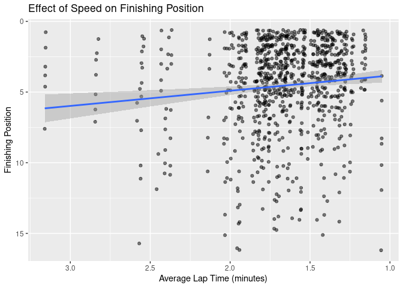

Eila’s Rough Notes
================

``` r
library(tidyverse)
library(readr)
library(dplyr)
library(skimr)
library(here)
```

``` r
f1merged_hybrid <- read_csv("/cloud/project/data/f1merged_hybrid.csv")

key_teams <- c("Ferrari", 
               "McLaren",
               "Mercedes",
               "Red Bull",
               "Williams")

key_team_colours <- c("Mercedes" = "#00d2be",
                  "Red Bull" = "#0600ef",
                  "Ferrari" = "#dc0000",
                  "McLaren" = "#ff8700",
                  "Williams" = "#0082fa")
```

## Are There Hidden Variables in the Mercedes/Driver Performance Visualisation?

### Are There an Abundance of Mercedes Racers?

First, we want to check if this large number of successful Mercedes
drivers is due to a larger number of Mercedes drivers in general.

``` r
f1merged_hybrid %>%
  filter(constructorname %in% key_teams) %>%
  group_by(constructorname) %>%
  count(constructorname)
```

    ## # A tibble: 5 × 2
    ## # Groups:   constructorname [5]
    ##   constructorname     n
    ##   <chr>           <int>
    ## 1 Ferrari           276
    ## 2 McLaren           276
    ## 3 Mercedes          276
    ## 4 Red Bull          276
    ## 5 Williams          276

This shows us that we are only considering a subset of the data with the
exact same numbers of drivers per key constructor. Thus, the high number
of wins of Mercedes is not due to an abundance of racers using Mercedes.

### Do Faster Cars Have More Wins, Not Just Mercedes?

What if Mercedes engines just make for a faster car than the others?
(i.e. having a Mercedes doesn’t help you win, having a fast car does).
We can check this by seeing if Mercedes have a higher average speed
compared to the other key constructors.

Notes:  
\* We are including drivers who haven’t won (but excluding those that
don’t finish) in this analysis since we just want to investigate the
driver’s speeds. \* We also keep in mind that F1 tracks are always
between 305-310 km, and the 5km difference does nothing significant to
the different lap times. \* We round avg_lap_time_min to 5dp since the
most accurate time measurement we have is milliseconds.

``` r
f1merged_hybrid %>%
  filter(constructorname %in% key_teams) %>%
  drop_na() %>%
  summarise(constructorname,
            "avg_lap_time_min" = ((milliseconds/laps)/60000) %>% round(5)) %>%
  group_by(constructorname) %>%
  ggplot(aes(x = avg_lap_time_min, y = constructorname, 
             fill = constructorname)) +
  geom_boxplot(alpha = 0.7, width = 0.5) +
  scale_x_reverse() +
  coord_cartesian(xlim = c(2.5,1)) +
  scale_fill_manual(values = key_team_colours) +
  theme(legend.position = "none") +
  labs(title = "Average Lap Time of Formula 1 Racers",
       x = "Lap Time (Minutes)",
       y = "Constructor")
```

<!-- --> Mercedes
drivers have a lower median lap time. This suggests that Mercedes
drivers have a higher average speed than other constructors, and thus
could be the reason for their large amount of wins. However, this would
suggest that Ferrari and Red Bull would also have a large amount of wins
since they have a similar median lap time, however our visualisation
earlier (Race Wins by Constructor) shows that Ferrari and Red Bull are
nowhere near Mercedes. Thus, it is unlikely that the average lap time
significantly boosts your chances of winning.

## What Makes a Bad F1 Driver?

One way of seeing what can improve the performance of a F1 driver is by
investigating what could cause a driver to have a bad performance.

### Do Driver’s with Lower Average Speeds Perform Worse?

Similarly to how we checked the speeds of the key teams, we want to the
relationship between the average lap time and their performance. We can
do this by plotting the finishing position against the average lap time
and colouring by constructor to see if there is any connection. We will
exclude rivers who didn’t finish the race (i.e. position = N/A) for now

``` r
f1merged_hybrid %>%
  filter(constructorname %in% key_teams) %>%
  summarise(constructorname, 
            "avg_lap_time_min" = ((milliseconds/laps)/60000) %>% round(5),
            position) %>%
  drop_na() %>%
  ggplot(aes(x = avg_lap_time_min, y = position)) +
  scale_x_reverse() +
  scale_y_reverse() +
  geom_jitter(alpha = 0.5) +
  geom_smooth(method = lm) +
  labs(title = "Effect of Speed on Finishing Position",
       x = "Average Lap Time (minutes)",
       y = "Finishing Position")
```

    ## `geom_smooth()` using formula 'y ~ x'

<!-- --> There
doesn’t appear to be a strong connection between a driver’s lap time and
their finishing positions. Thus, the driver’s speed doesn’t seem to have
a strong influence on their performance in the race.

### Does The Type of Car Impact a Driver’s Performance?

``` r
f1merged_hybrid %>%
  filter(constructorname %in% key_teams) %>%
  ggplot(aes(x = position, y = constructorname,
             fill = constructorname)) +
  #geom_violin(alpha = 0.2) +
  geom_boxplot(alpha = 0.3) +
  scale_fill_manual(values = key_team_colours) +
  scale_x_reverse() +
  scale_y_discrete(position = "right") +
  labs(title = "Win Densities of F1 Car Constructors",
       x = "Finishing Position",
       y = "") +
  theme(legend.position = "none")
```

    ## Warning: Removed 199 rows containing non-finite values (stat_boxplot).

<!-- -->
This visualisation shows us that drivers using Willams’ or McLaurens
tend to have less wins than other constructors, and Mercedes again shows
a strong lead. This again suggests that having Mercedes as the
constructor may lead to a better performance.
