Exploratory Data Analysis
================
Callum Stewart

``` r
library(tidyverse)
library(readr)
library(dplyr)
library(skimr)
library(here)
library(forcats)
library(tidymodels)
```

``` r
f1merged <- read_csv(here("data/f1merged.csv"))
f1merged_hybrid <- read_csv(here("data/f1merged_hybrid.csv"))
stops_merged <- read_csv(here("data/stops_merged.csv"))
```

``` r
hybrid_era <- (2014:2020)
```

``` r
team_colours <- c("Mercedes" = "#00d2be",
                  "Red Bull" = "#0600ef",
                  "Ferrari" = "#dc0000",
                  "Racing Point" = "#F596C8",
                  "Force India" = "#f596c8",
                  "AlphaTauri" = "#ffffff",
                  "McLaren" = "#ff8700",
                  "Renault" = "#fff500",
                  "Williams" = "#0082fa",
                  "Toro Rosso" = "#469BFF",
                  "Lotus F1" = "#000000",
                  "Alfa Romeo" = "#960000",
                  "Sauber" = "#960000",
                  "Haas F1 Team" = "#787878")
                  


f1merged_hybrid %>%
  filter(positionText == 1) %>%
count(constructorname, sort = TRUE) %>% 
  ggplot(aes(x = n, 
             y = factor(constructorname, levels = rev(levels(factor(constructorname)))),
             fill = constructorname)) +
  geom_col(aes()) + 
 scale_fill_manual(values = team_colours) +
  labs(title = "Race Wins by Constructor",
       subtitle = "In the hybrid era (2014-2020)",
       x = "Race Wins",
      y = "Constructor") +
  guides(fill = "none")
```

<!-- -->

``` r
f1merged_hybrid %>%
  filter(positionText %in% 1:3) %>%
count(constructorname, sort = TRUE) %>% 
  ggplot(aes(x = n, 
             y = factor(constructorname, levels = rev(levels(factor(constructorname)))),
             fill = constructorname)) +
  geom_col(aes()) + 
 scale_fill_manual(values = team_colours) +
  labs(title = "Podium Finishes by Constructor",
       subtitle = "In the hybrid era (2014-2020)",
       x = "Podiums",
      y = "Constructor") + 
  guides(fill = "none")
```

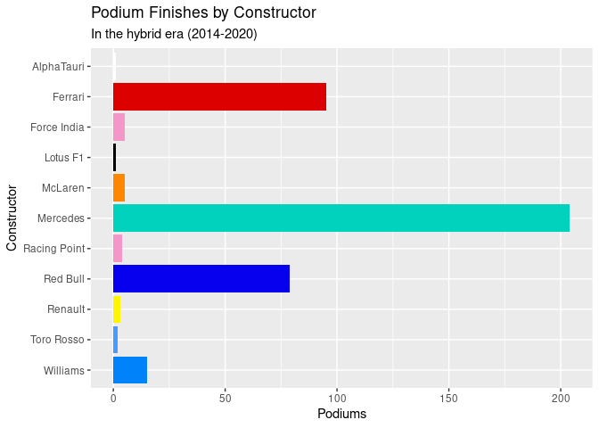<!-- -->

``` r
f1merged_hybrid %>%
  filter(grid == 1) %>%
count(constructorname, sort = TRUE) %>% 
  ggplot(aes(x = n, 
             y = factor(constructorname, levels = rev(levels(factor(constructorname)))),
             fill = constructorname)) +
  geom_col(aes()) + 
 scale_fill_manual(values = team_colours) +
  labs(title = "Pole Positions by Constructor",
       subtitle = "In the hybrid era (2014-2020)",
       x = "Pole Positions",
      y = "Constructor") + 
  guides(fill = "none")
```

<!-- -->

``` r
f1merged_hybrid %>%
  group_by(constructorname) %>%
  summarise(total_points = sum(points)) %>%
  filter(total_points > 5) %>%
   ggplot(aes(x = total_points, 
             y = factor(constructorname, levels = rev(levels(factor(constructorname)))),
             fill = constructorname)) +
  geom_col(aes()) + 
 scale_fill_manual(values = team_colours) +
  labs(title = "Total Championship Points by Constructor",
       subtitle = "In the hybrid era (2014-2020)",
       x = "Points",
      y = "Constructor") + 
  guides(fill = "none")
```

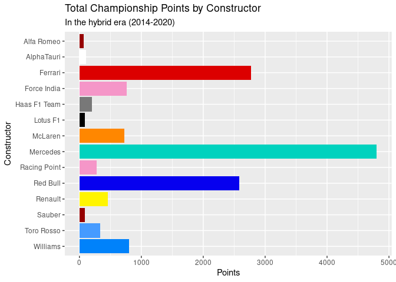<!-- -->

``` r
f1merged_hybrid %>%
  filter(!is.na(position)) %>%
  ggplot(aes(x = grid, y = position)) +
  geom_jitter() +
  geom_smooth(method = lm,
              formula = y ~ x,
              colour = "red") +
  labs(x = "Qualifying Position",
       y = "Race Finishing Position",
       title = "Qualifying Position vs. Finishing Position",
       subtitle = "In the hybrid era (2014-2020)")
```

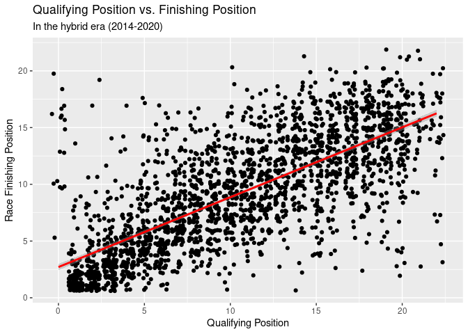<!-- -->

``` r
key_teams <- c("Ferrari", 
               "McLaren",
               "Mercedes",
               "Red Bull",
               "Williams")


f1merged_hybrid %>%
  group_by(constructorname) %>%
  filter(constructorname %in% key_teams & positionText == "R") %>%
  count(constructorname, sort = TRUE) %>%
  summarise(mean_ret_per_season = n/(n_distinct(f1merged_hybrid$year))) %>%
  ggplot(aes(x = mean_ret_per_season, 
             y = factor(constructorname, levels = rev(levels(factor(constructorname)))), 
             fill = constructorname)) +
  geom_col() + 
  scale_fill_manual(values = team_colours) +
  labs(x = "Mean Retirements Per Season",
       y = "Constructor",
       title = "Retirements Per Season by Constructor",
       subtitle = "In the Hybrid Era (2014-2020)") +
  guides(fill = "none")
```

<!-- -->

``` r
#looking at outliers
f1merged_hybrid %>%
  filter(grid == 0)
```

    ## # A tibble: 27 × 27
    ##    raceId  year round racename         date       driverId driverRef    surname 
    ##     <dbl> <dbl> <dbl> <chr>            <date>        <dbl> <chr>        <chr>   
    ##  1    931  2015     6 Monaco Grand Pr… 2015-05-24      832 sainz        Sainz   
    ##  2    926  2015     1 Australian Gran… 2015-03-15      822 bottas       Bottas  
    ##  3    927  2015     2 Malaysian Grand… 2015-03-29      829 stevens      Stevens 
    ##  4    953  2016     6 Monaco Grand Pr… 2016-05-29      830 max_verstap… Verstap…
    ##  5    953  2016     6 Monaco Grand Pr… 2016-05-29      831 nasr         Nasr    
    ##  6    956  2016     9 Austrian Grand … 2016-07-03       13 massa        Massa   
    ##  7    956  2016     9 Austrian Grand … 2016-07-03      826 kvyat        Kvyat   
    ##  8    969  2017     1 Australian Gran… 2017-03-26      817 ricciardo    Ricciar…
    ##  9    983  2017    15 Malaysian Grand… 2017-10-01        8 raikkonen    Räikkön…
    ## 10    998  2018    10 British Grand P… 2018-07-08      843 brendon_har… Hartley 
    ## # … with 17 more rows, and 19 more variables: constructorId <dbl>,
    ## #   constructorRef <chr>, constructorname <chr>, constructornat <chr>,
    ## #   resultId <dbl>, number <dbl>, grid <dbl>, position <dbl>,
    ## #   positionText <chr>, positionOrder <dbl>, points <dbl>, laps <dbl>,
    ## #   time <chr>, milliseconds <dbl>, fastestLap <dbl>, rank <dbl>,
    ## #   fastestLapTime <chr>, fastestLapSpeed <dbl>, statusId <dbl>

``` r
#Seem to be a small number of irregularities we can safely remove
```

``` r
quali_grid_tidy <- f1merged_hybrid %>%
  filter(!is.na(position) & grid != 0) 
 
  
  quali_grid_tidy %>%
   ggplot(aes(x = grid, y = position)) +
  geom_jitter() +
  geom_smooth(method = lm,
              formula = y ~ x,
              colour = "red") +
  labs(x = "Qualifying Position",
       y = "Race Finishing Position",
       title = "Qualifying Position vs. Finishing Position",
       subtitle = "In the hybrid era (2014-2020)") 
```

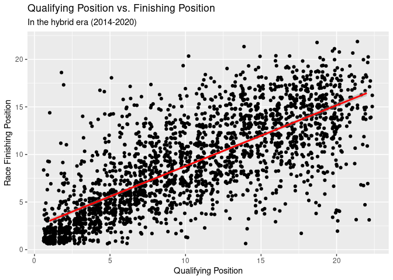<!-- -->

``` r
posi_grid_fit <- linear_reg() %>%
  set_engine("lm") %>%
  fit(position ~ grid, data = quali_grid_tidy)

tidy(posi_grid_fit)
```

    ## # A tibble: 2 × 5
    ##   term        estimate std.error statistic  p.value
    ##   <chr>          <dbl>     <dbl>     <dbl>    <dbl>
    ## 1 (Intercept)    2.39     0.138       17.3 7.73e-63
    ## 2 grid           0.639    0.0115      55.4 0

``` r
glance(posi_grid_fit)
```

    ## # A tibble: 1 × 12
    ##   r.squared adj.r.squared sigma statistic p.value    df logLik    AIC    BIC
    ##       <dbl>         <dbl> <dbl>     <dbl>   <dbl> <dbl>  <dbl>  <dbl>  <dbl>
    ## 1     0.571         0.571  3.32     3067.       0     1 -6040. 12086. 12103.
    ## # … with 3 more variables: deviance <dbl>, df.residual <int>, nobs <int>

``` r
posi_grid_fit_aug <- augment(posi_grid_fit$fit)

posi_grid_fit_aug %>%
  ggplot(aes(x = .fitted, y = .resid)) + 
  geom_jitter() +
  geom_hline(yintercept = 0,
             linetype = "dashed") +
  labs(x = "Predicted Value",
       y = "Residuals",
       title = "Predicted Values vs Residuals")
```

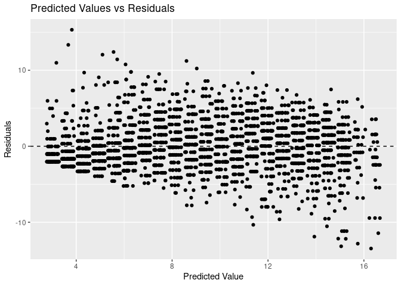<!-- -->

``` r
quali_grid_tidy_leaders <- quali_grid_tidy %>%
  filter(grid <=5)
 
  quali_grid_tidy_leaders %>%
   ggplot(aes(x = grid, y = position)) +
  geom_jitter() +
  geom_smooth(method = lm,
              formula = y ~ x,
              colour = "red") +
  labs(x = "Qualifying Position",
       y = "Race Finishing Position",
       title = "Qualifying Position vs. Finishing Position (Top 5 Qualifiers)",
       subtitle = "In the hybrid era (2014-2020)") 
```

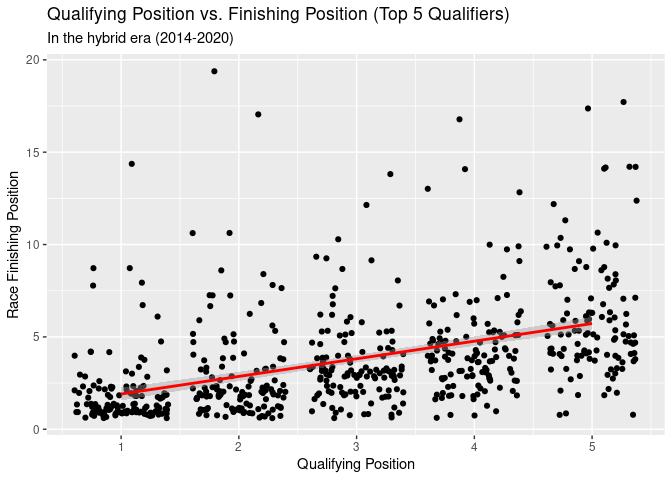<!-- -->

``` r
posi_grid_fit_leaders <- linear_reg() %>%
  set_engine("lm") %>%
  fit(position ~ grid, data = quali_grid_tidy_leaders)

tidy(posi_grid_fit_leaders)
```

    ## # A tibble: 2 × 5
    ##   term        estimate std.error statistic  p.value
    ##   <chr>          <dbl>     <dbl>     <dbl>    <dbl>
    ## 1 (Intercept)    0.954    0.244       3.91 1.04e- 4
    ## 2 grid           0.954    0.0747     12.8  2.84e-33

``` r
glance(posi_grid_fit_leaders)
```

    ## # A tibble: 1 × 12
    ##   r.squared adj.r.squared sigma statistic  p.value    df logLik   AIC   BIC
    ##       <dbl>         <dbl> <dbl>     <dbl>    <dbl> <dbl>  <dbl> <dbl> <dbl>
    ## 1     0.209         0.208  2.61      163. 2.84e-33     1 -1468. 2943. 2956.
    ## # … with 3 more variables: deviance <dbl>, df.residual <int>, nobs <int>

``` r
posi_grid_fit_leaders_aug <- augment(posi_grid_fit_leaders$fit)

posi_grid_fit_leaders_aug %>%
  ggplot(aes(x = .fitted, y = .resid)) + 
  geom_jitter() +
  geom_hline(yintercept = 0,
             linetype = "dashed") +
  labs(x = "Predicted Value",
       y = "Residuals",
       title = "Predicted Values vs Residuals")
```

<!-- -->

``` r
quali_grid_tidy_rest <- quali_grid_tidy %>%
  filter(grid >5)
 
  quali_grid_tidy_rest %>%
   ggplot(aes(x = grid, y = position)) +
  geom_jitter() +
  geom_smooth(method = lm,
              formula = y ~ x,
              colour = "red") +
  labs(x = "Qualifying Position",
       y = "Race Finishing Position",
       title = "Qualifying Position vs. Finishing Position (Without Top 5 Qualifiers)",
       subtitle = "In the hybrid era (2014-2020)") 
```

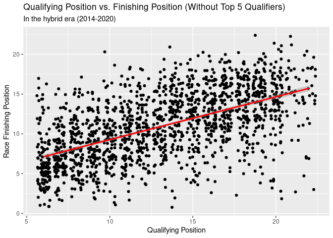<!-- -->

``` r
posi_grid_fit_rest <- linear_reg() %>%
  set_engine("lm") %>%
  fit(position ~ grid, data = quali_grid_tidy_rest)

tidy(posi_grid_fit_rest)
```

    ## # A tibble: 2 × 5
    ##   term        estimate std.error statistic   p.value
    ##   <chr>          <dbl>     <dbl>     <dbl>     <dbl>
    ## 1 (Intercept)    3.90     0.259       15.1 2.78e- 48
    ## 2 grid           0.537    0.0187      28.8 1.16e-148

``` r
glance(posi_grid_fit_rest)
```

    ## # A tibble: 1 × 12
    ##   r.squared adj.r.squared sigma statistic   p.value    df logLik   AIC   BIC
    ##       <dbl>         <dbl> <dbl>     <dbl>     <dbl> <dbl>  <dbl> <dbl> <dbl>
    ## 1     0.330         0.329  3.49      829. 1.16e-148     1 -4505. 9016. 9032.
    ## # … with 3 more variables: deviance <dbl>, df.residual <int>, nobs <int>

``` r
posi_grid_fit_rest_aug <- augment(posi_grid_fit_rest$fit)

posi_grid_fit_rest_aug %>%
  ggplot(aes(x = .fitted, y = .resid)) + 
  geom_jitter() +
  geom_hline(yintercept = 0,
             linetype = "dashed") +
  labs(x = "Predicted Value",
       y = "Residuals",
       title = "Predicted Values vs Residuals")
```

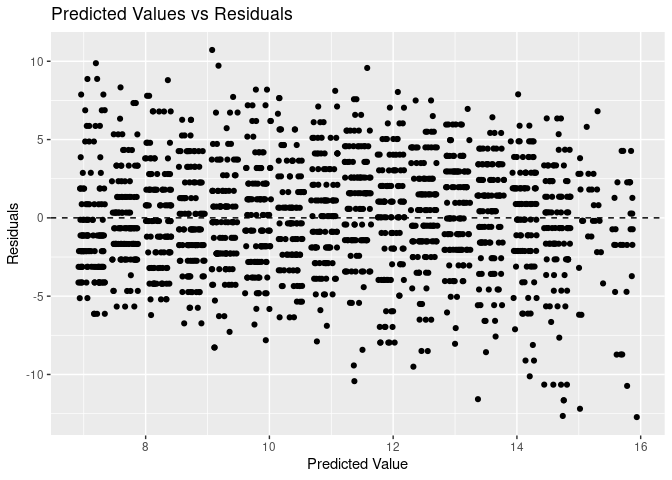<!-- -->

Models suggest a much stronger correlation between grid position and
finishing position for the drivers qualifying in the top 5.

If you qualify near the front you are likely to stay there, not as
strong a relationship further back in the field.

If you have one of the fastest cars and qualify near the front you are
likely to leave the rest of the field behind (better pace, not as likely
to be in someone’s dirty air) (also less likely to get involved in any
incidents/collisions, particularly at race start.) (All of these factors
would be strongest if you qualified P1)

Qualifying near the front of the grid is a very strong predictor of race
success. But of course having the clear fastest car would also correlate
very strongly with both of these.

``` r
f1merged_hybrid %>%
  mutate(mercedes_or_not = if_else
         (constructorname == "Mercedes",
                     true = "Mercedes",
                    false = "Everyone Else")) %>%
  filter(grid == 1) %>%
count(mercedes_or_not, sort = TRUE) %>% 
  ggplot(aes(x = n, 
             y = factor(mercedes_or_not, levels = rev(levels(factor(mercedes_or_not)))),
             fill = mercedes_or_not)) +
  geom_col(aes()) + 
 scale_fill_manual(values = team_colours) +
  labs(title = "Pole Positions by Constructor",
       subtitle = "In the hybrid era (2014-2020)",
       x = "Pole Positions",
      y = "Constructor") + 
  guides(fill = "none")
```

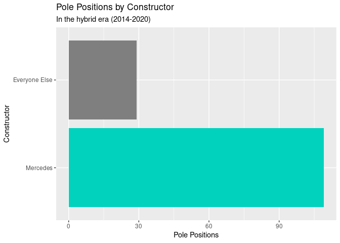<!-- -->

``` r
f1merged_hybrid %>%
  filter(position == 1) %>%
  count(constructorname) %>%
  rename(race_wins = n) %>%
  mutate(percent = (race_wins / sum(race_wins)) * 100)
```

    ## # A tibble: 5 × 3
    ##   constructorname race_wins percent
    ##   <chr>               <int>   <dbl>
    ## 1 AlphaTauri              1   0.725
    ## 2 Ferrari                17  12.3  
    ## 3 Mercedes              102  73.9  
    ## 4 Racing Point            1   0.725
    ## 5 Red Bull               17  12.3

``` r
f1merged_hybrid %>%
  filter(grid == 1) %>%
  count(constructorname) %>%
  rename(pole_positions = n) %>%
  mutate(percent = (pole_positions / sum(pole_positions)) * 100)
```

    ## # A tibble: 5 × 3
    ##   constructorname pole_positions percent
    ##   <chr>                    <int>   <dbl>
    ## 1 Ferrari                     21  15.2  
    ## 2 Mercedes                   109  79.0  
    ## 3 Racing Point                 1   0.725
    ## 4 Red Bull                     6   4.35 
    ## 5 Williams                     1   0.725

``` r
f1merged_hybrid %>%
  mutate(mercedes_or_not = if_else
         (constructorname == "Mercedes",
                     true = "Mercedes",
                    false = "Everyone Else")) %>%
  filter(position == 1) %>%
count(mercedes_or_not, sort = TRUE) %>% 
  ggplot(aes(x = n, 
             y = factor(mercedes_or_not, levels = rev(levels(factor(mercedes_or_not)))),
             fill = mercedes_or_not)) +
  geom_col(aes()) + 
 scale_fill_manual(values = team_colours) +
  labs(title = "Race Wins by Constructor",
       subtitle = "In the hybrid era (2014-2020)",
       x = "Race Wins",
      y = "Constructor") + 
  guides(fill = "none")
```

<!-- -->

``` r
f1merged_hybrid %>% 
  filter(grid == 1) %>%
 mutate(pole_win = if_else(!is.na(position) & position == 1,
              true = "Pole Sitter Wins",
             false = "Other Driver Wins")) %>%
  count(pole_win) %>%
  mutate(percentage = (n / sum(n)) * 100)
```

    ## # A tibble: 2 × 3
    ##   pole_win              n percentage
    ##   <chr>             <int>      <dbl>
    ## 1 Other Driver Wins    65       47.1
    ## 2 Pole Sitter Wins     73       52.9

``` r
f1merged_hybrid %>% 
  filter(grid == 1) %>%
 mutate(pole_win = if_else(!is.na(position) & position %in% 1:3,
              true = "Pole Sitter Podium",
             false = "Pole Sitter Off Podium")) %>%
  count(pole_win) %>%
  mutate(percentage = (n / sum(n)) * 100)
```

    ## # A tibble: 2 × 3
    ##   pole_win                   n percentage
    ##   <chr>                  <int>      <dbl>
    ## 1 Pole Sitter Off Podium    24       17.4
    ## 2 Pole Sitter Podium       114       82.6

The driver who qualifies in 1st place goes on to win the race \~53% of
the time, and finishes on the podium \~83% of the time.

``` r
ret_season <- f1merged_hybrid %>%
  filter(constructorname %in% key_teams & positionText == "R") %>%
  group_by(year, constructorname) %>%
  count(constructorname) %>%
  summarise(retirements = n, .groups = "drop")


ret_season
```

    ## # A tibble: 35 × 3
    ##     year constructorname retirements
    ##    <dbl> <chr>                 <int>
    ##  1  2014 Ferrari                   3
    ##  2  2014 McLaren                   2
    ##  3  2014 Mercedes                  5
    ##  4  2014 Red Bull                  5
    ##  5  2014 Williams                  4
    ##  6  2015 Ferrari                   6
    ##  7  2015 McLaren                  12
    ##  8  2015 Mercedes                  2
    ##  9  2015 Red Bull                  4
    ## 10  2015 Williams                  3
    ## # … with 25 more rows

``` r
points_season <- f1merged_hybrid %>%
  filter(constructorname %in% key_teams) %>%
  group_by(year, constructorname) %>%
  summarise(total_points = sum(points), .groups = "drop")

points_season
```

    ## # A tibble: 35 × 3
    ##     year constructorname total_points
    ##    <dbl> <chr>                  <dbl>
    ##  1  2014 Ferrari                  216
    ##  2  2014 McLaren                  181
    ##  3  2014 Mercedes                 701
    ##  4  2014 Red Bull                 405
    ##  5  2014 Williams                 320
    ##  6  2015 Ferrari                  428
    ##  7  2015 McLaren                   27
    ##  8  2015 Mercedes                 703
    ##  9  2015 Red Bull                 187
    ## 10  2015 Williams                 257
    ## # … with 25 more rows

``` r
rets_points_season <- inner_join(points_season, ret_season)
```

    ## Joining, by = c("year", "constructorname")

``` r
rets_points_season %>%
  group_by(constructorname) %>%
   summarise(mean_ret_season = sum(retirements) / (n_distinct(rets_points_season$year)),
             mean_points_season = sum(total_points) / (n_distinct(rets_points_season$year)))
```

    ## # A tibble: 5 × 3
    ##   constructorname mean_ret_season mean_points_season
    ##   <chr>                     <dbl>              <dbl>
    ## 1 Ferrari                    5.14               396.
    ## 2 McLaren                    8                  103.
    ## 3 Mercedes                   2.43               686.
    ## 4 Red Bull                   6.43               369 
    ## 5 Williams                   5                  115.

``` r
key_team_colours <- c("Mercedes" = "#00d2be",
                  "Red Bull" = "#0600ef",
                  "Ferrari" = "#dc0000",
                  "McLaren" = "#ff8700",
                  "Williams" = "#0082fa")

rets_points_season %>%
  ggplot(aes(x = retirements, y = total_points, colour = constructorname)) +
  geom_point(size = 2.5) + 
  geom_smooth(method = "lm",
              formula = y ~ x,
              colour = "black",
              se = FALSE) +
  labs(x = "Retirements",
       y = "Total Championship Points",
       title = "Retirements vs Total Points",
       subtitle = "Per Season",
       colour = "Constructor") +
  scale_colour_manual(values = key_team_colours)
```

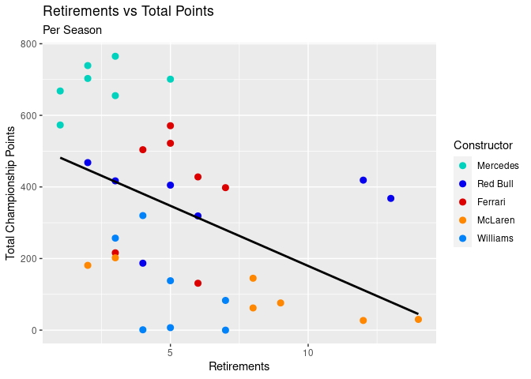<!-- -->

``` r
rets_points_fit <- linear_reg() %>%
  set_engine("lm") %>%
  fit(total_points ~ retirements, data = rets_points_season)

tidy(rets_points_fit)
```

    ## # A tibble: 2 × 5
    ##   term        estimate std.error statistic      p.value
    ##   <chr>          <dbl>     <dbl>     <dbl>        <dbl>
    ## 1 (Intercept)    515.       70.2      7.34 0.0000000197
    ## 2 retirements    -33.6      11.1     -3.03 0.00471

``` r
glance(rets_points_fit)
```

    ## # A tibble: 1 × 12
    ##   r.squared adj.r.squared sigma statistic p.value    df logLik   AIC   BIC
    ##       <dbl>         <dbl> <dbl>     <dbl>   <dbl> <dbl>  <dbl> <dbl> <dbl>
    ## 1     0.218         0.194  217.      9.19 0.00471     1  -237.  480.  484.
    ## # … with 3 more variables: deviance <dbl>, df.residual <int>, nobs <int>

``` r
rets_points_fit_aug <- augment(rets_points_fit$fit)

rets_points_fit_aug %>%
  ggplot(aes(x = .fitted, y = .resid)) + 
  geom_jitter() +
  geom_hline(yintercept = 0,
             linetype = "dashed") +
  labs(x = "Predicted Value",
       y = "Residuals",
       title = "Predicted Values vs Residuals")
```

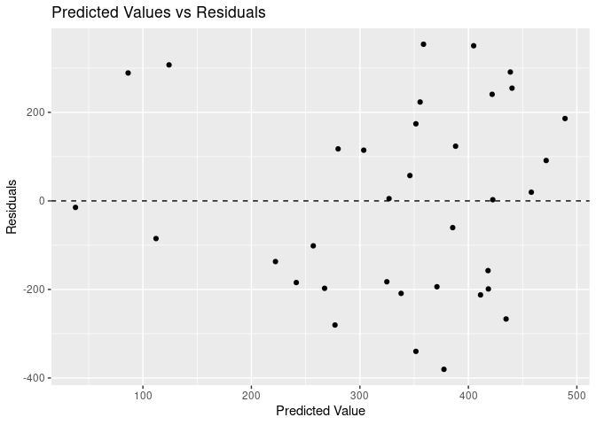<!-- -->
Our model predicts a constructor with 0 retirements in a season would
score 515 points in a season (Dubious, probably due to our comparison
group being unintentionally weighted towards top teams). It predicts
that for each additional retirement in a season, a team would score 34
fewer points.

The R^2 value suggests 21.8% of the variability in points per season can
be explained by the number of retirements in a season.

The predicted value vs. residuals plot doesn’t show a clear pattern and
appears to be a reasonably random scatter. As such a linear model is
likely a good fit for our data.

``` r
stops_merged %>%
  filter(constructorname %in% key_teams & !is.na(milliseconds)
        & milliseconds < 9*10^5) %>%
  group_by(constructorname) %>%
  summarise(mean_stop = mean(milliseconds),
            median_stop = median(milliseconds))
```

    ## # A tibble: 5 × 3
    ##   constructorname mean_stop median_stop
    ##   <chr>               <dbl>       <dbl>
    ## 1 Ferrari            24552.      23638.
    ## 2 McLaren            24960.      23798.
    ## 3 Mercedes           24004.      23348.
    ## 4 Red Bull           24500.      23371 
    ## 5 Williams           24859.      23860

``` r
#skewed version
stops_merged %>%
 filter(constructorname %in% key_teams & !is.na(milliseconds)) %>%
  ggplot(aes(x = milliseconds, 
             y = factor(constructorname, levels = rev(levels(factor(constructorname)))), 
             fill = constructorname)) +
  geom_boxplot() +
  scale_fill_manual(values = key_team_colours) +
  scale_x_continuous(labels = label_number(scale = 0.001)) +
  guides(fill = "none") +
  labs(x = "Pit Stop Time (Seconds)",
       y = "Constructor",
       title = "Pit Stop Times by Constructor",
       caption = "A pit stop is recorded here as the total time in the pit lane")
```

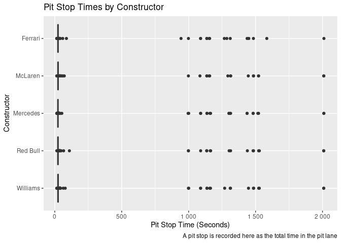<!-- -->

``` r
# red flag stops removed
stops_merged %>%
 filter(constructorname %in% key_teams & !is.na(milliseconds)
        & milliseconds < 9*10^5) %>%
  ggplot(aes(x = milliseconds,
             y = factor(constructorname, levels = rev(levels(factor(constructorname)))), 
             fill = constructorname)) +
  geom_boxplot() +
  scale_fill_manual(values = key_team_colours) +
  scale_x_continuous(labels = label_number(scale = 0.001)) +
  guides(fill = "none") +
  labs(x = "Pit Stop Time (Seconds)",
       y = "Constructor",
       title = "Pit Stop Times by Constructor",
       caption = "A pit stop is recorded here as the total time in the pit lane")
```

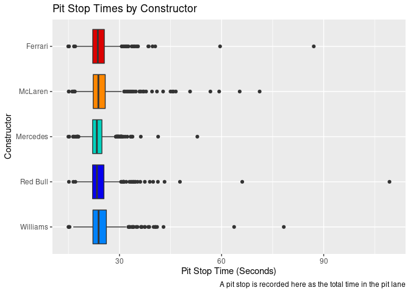<!-- -->

``` r
#very suspicious outlying times
 stops_merged %>%
filter(constructorname %in% key_teams & !is.na(milliseconds)) %>%
   arrange(desc(milliseconds)) %>%
   relocate(year, racename, driverId, duration, milliseconds)
```

    ## # A tibble: 2,491 × 30
    ##     year racename         driverId duration milliseconds raceId round date      
    ##    <dbl> <chr>               <dbl> <chr>           <dbl>  <dbl> <dbl> <date>    
    ##  1  2016 Brazilian Grand…       20 33:30.6…      2010637    967    20 2016-11-13
    ##  2  2016 Brazilian Grand…        1 33:30.3…      2010361    967    20 2016-11-13
    ##  3  2016 Brazilian Grand…       18 33:30.0…      2010062    967    20 2016-11-13
    ##  4  2016 Brazilian Grand…        3 33:29.7…      2009747    967    20 2016-11-13
    ##  5  2016 Brazilian Grand…      830 33:29.6…      2009643    967    20 2016-11-13
    ##  6  2016 Brazilian Grand…       13 33:29.6…      2009630    967    20 2016-11-13
    ##  7  2016 Brazilian Grand…        4 33:28.7…      2008789    967    20 2016-11-13
    ##  8  2016 Brazilian Grand…      817 33:28.6…      2008600    967    20 2016-11-13
    ##  9  2016 Brazilian Grand…      822 33:28.5…      2008595    967    20 2016-11-13
    ## 10  2017 Azerbaijan Gran…        8 26:23.8…      1583848    976     8 2017-06-25
    ## # … with 2,481 more rows, and 22 more variables: driverRef <chr>,
    ## #   surname <chr>, constructorId <dbl>, constructorRef <chr>,
    ## #   constructorname <chr>, constructornat <chr>, resultId <dbl>, number <dbl>,
    ## #   grid <dbl>, position <dbl>, positionText <chr>, positionOrder <dbl>,
    ## #   points <dbl>, laps <dbl>, fastestLap <dbl>, rank <dbl>,
    ## #   fastestLapTime <chr>, fastestLapSpeed <dbl>, statusId <dbl>, stop <dbl>,
    ## #   lap <dbl>, time <time>

-   Note: Due to what is likely an error in data collection, a small
    number of red flagged (suspended for safety reasons) sessions have
    been recorded as pit stops.

-   According to the data above the 2016 Brazilian Grand Prix saw 9
    concurrent **33 minute** pit stops. In reality the race was red
    flagged after a driver crashed on the pit straight and there was a
    roughly 35 minute delay before it resumed.

-   The clearly erroneous pit stops are all over 15 minutes in duration,
    after which there is a large jump to the first genuine long stop at
    1:49 in length. As such it makes sense to remove any pit stops over
    15 minutes duration from our analysis

``` r
stops_season <- stops_merged %>%
  group_by(year, constructorname) %>%
  filter(constructorname %in% key_teams & !is.na(milliseconds)
        & milliseconds < 9*10^5) %>%
  summarise(median_stoptime = median(milliseconds))
```

    ## `summarise()` has grouped output by 'year'. You can override using the `.groups` argument.

``` r
stops_points_season <- inner_join(points_season, stops_season)
```

    ## Joining, by = c("year", "constructorname")

``` r
stops_points_season
```

    ## # A tibble: 35 × 4
    ##     year constructorname total_points median_stoptime
    ##    <dbl> <chr>                  <dbl>           <dbl>
    ##  1  2014 Ferrari                  216          23928.
    ##  2  2014 McLaren                  181          23804 
    ##  3  2014 Mercedes                 701          23886.
    ##  4  2014 Red Bull                 405          23443 
    ##  5  2014 Williams                 320          24420.
    ##  6  2015 Ferrari                  428          24158 
    ##  7  2015 McLaren                   27          23806.
    ##  8  2015 Mercedes                 703          23165 
    ##  9  2015 Red Bull                 187          23997 
    ## 10  2015 Williams                 257          24412 
    ## # … with 25 more rows

``` r
stops_points_season %>%
  ggplot(aes(x = median_stoptime, y = total_points, colour = constructorname)) +
  geom_point(size = 2.5) + 
  geom_smooth(method = "lm",
              formula = y ~ x,
              colour = "black",
              se = FALSE) +
  labs(x = "Median Pit Stop Time (Seconds)",
       y = "Total Championship Points",
       title = "Pit Stop Time vs Total Points",
       subtitle = "Per Season",
       colour = "Constructor") +
  scale_colour_manual(values = key_team_colours) +
  scale_x_continuous(labels = label_number(scale = 0.001))
```

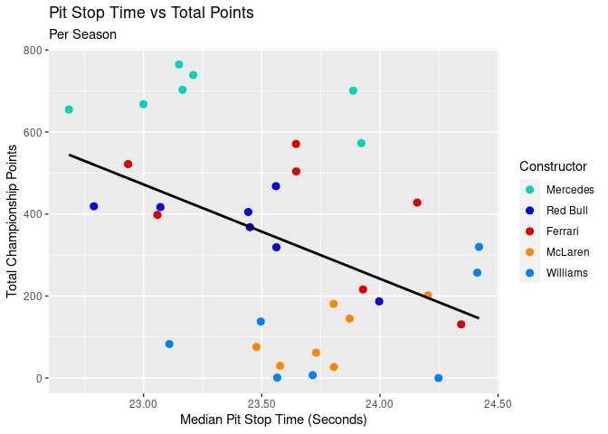<!-- -->

``` r
stops_points_fit <- linear_reg() %>%
  set_engine("lm") %>%
  fit(total_points ~ median_stoptime, data = stops_points_season)

tidy(stops_points_fit)
```

    ## # A tibble: 2 × 5
    ##   term            estimate std.error statistic p.value
    ##   <chr>              <dbl>     <dbl>     <dbl>   <dbl>
    ## 1 (Intercept)     5759.    1912.          3.01 0.00495
    ## 2 median_stoptime   -0.230    0.0810     -2.84 0.00770

``` r
glance(stops_points_fit)
```

    ## # A tibble: 1 × 12
    ##   r.squared adj.r.squared sigma statistic p.value    df logLik   AIC   BIC
    ##       <dbl>         <dbl> <dbl>     <dbl>   <dbl> <dbl>  <dbl> <dbl> <dbl>
    ## 1     0.196         0.172  220.      8.06 0.00770     1  -237.  481.  485.
    ## # … with 3 more variables: deviance <dbl>, df.residual <int>, nobs <int>

``` r
stops_points_fit_aug <- augment(stops_points_fit$fit)

stops_points_fit_aug %>%
  ggplot(aes(x = .fitted, y = .resid)) + 
  geom_jitter() +
  geom_hline(yintercept = 0,
             linetype = "dashed") +
  labs(x = "Predicted Value",
       y = "Residuals",
       title = "Predicted Values vs Residuals")
```

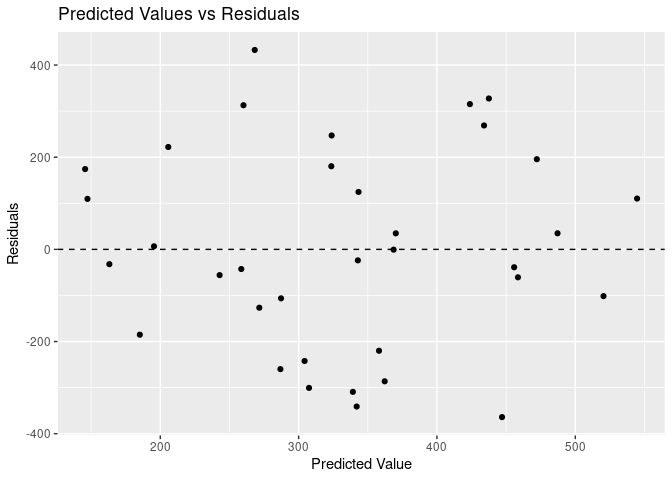<!-- -->
Our model suggests that a team with a median stop time of 0 milliseconds
would be expected to score 5759 points on average. In practice neither
of those things are possible.

Our model suggests that all else held equal, for each 1 millisecond
increase in a team’s median stop time, they would be expected to score
0.2299 fewer points across a season.

The R^2 value of our model suggests that 19.6% of the variability in
points per season can be explained by median stop time.

The plot of predicted values vs residuals is a random scatter with no
pattern, suggesting that a linear model would be a good fit in this
case.

``` r
stops_rets_points <- inner_join(rets_points_season, stops_points_season)
```

    ## Joining, by = c("year", "constructorname", "total_points")

``` r
stops_rets_points_fit <- linear_reg() %>%
  set_engine("lm") %>%
  fit(total_points ~ median_stoptime + retirements, data = stops_rets_points)

tidy(stops_rets_points_fit)
```

    ## # A tibble: 3 × 5
    ##   term            estimate std.error statistic  p.value
    ##   <chr>              <dbl>     <dbl>     <dbl>    <dbl>
    ## 1 (Intercept)     6202.    1636.          3.79 0.000627
    ## 2 median_stoptime   -0.241    0.0692     -3.48 0.00148 
    ## 3 retirements      -35.0      9.60       -3.65 0.000928

``` r
glance(stops_rets_points_fit)
```

    ## # A tibble: 1 × 12
    ##   r.squared adj.r.squared sigma statistic  p.value    df logLik   AIC   BIC
    ##       <dbl>         <dbl> <dbl>     <dbl>    <dbl> <dbl>  <dbl> <dbl> <dbl>
    ## 1     0.432         0.397  187.      12.2 0.000116     2  -231.  471.  477.
    ## # … with 3 more variables: deviance <dbl>, df.residual <int>, nobs <int>

``` r
stops_rets_points_fit_aug <- augment(stops_rets_points_fit$fit)

stops_rets_points_fit_aug %>%
  ggplot(aes(x = .fitted, y = .resid)) + 
  geom_jitter() +
  geom_hline(yintercept = 0,
             linetype = "dashed") +
  labs(x = "Predicted Value",
       y = "Residuals",
       title = "Predicted Values vs Residuals")
```

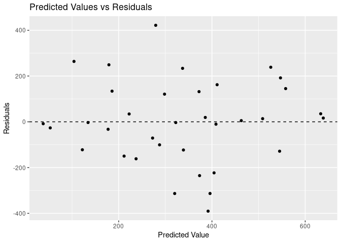<!-- -->
The combined model predicts that a team with 0 retirements in a season
and a median stop time of 0 milliseconds would be expected to score 6202
points, which doesn’t make any sense here.

Our model suggests that all else held equal, for each 1 millisecond
increase in a team’s median stop time, they would be expected to score
0.24 fewer points across a season.

Our model predicts that for each additional retirement in a season, a
team would be expected to score 35 points fewer on average.

The combined model has an adjusted R^2 of 39.7, which suggests 38.7% of
the variability in total points per season can be explained by median
stop time *and* number of retirements.

The predicted values vs residuals plot again shows a random scatter, so
a linear model is a good fit for this data.

``` r
quali_season <- f1merged_hybrid %>%
  filter(constructorname %in% key_teams & !is.na(grid)) %>%
  group_by(year, constructorname) %>%
  summarise(median_grid = median(grid))
```

    ## `summarise()` has grouped output by 'year'. You can override using the `.groups` argument.

``` r
final_model <- inner_join(quali_season, stops_rets_points)
```

    ## Joining, by = c("year", "constructorname")

``` r
final_model_fit <- linear_reg() %>%
  set_engine("lm") %>%
  fit(total_points ~ median_grid+ median_stoptime + retirements,
      data = final_model)

tidy(final_model_fit)
```

    ## # A tibble: 4 × 5
    ##   term            estimate std.error statistic  p.value
    ##   <chr>              <dbl>     <dbl>     <dbl>    <dbl>
    ## 1 (Intercept)     3371.     875.          3.85 5.47e- 4
    ## 2 median_grid      -37.1      3.81       -9.74 5.98e-11
    ## 3 median_stoptime   -0.115    0.0372     -3.10 4.14e- 3
    ## 4 retirements       -9.72     5.49       -1.77 8.67e- 2

``` r
glance(final_model_fit)
```

    ## # A tibble: 1 × 12
    ##   r.squared adj.r.squared sigma statistic  p.value    df logLik   AIC   BIC
    ##       <dbl>         <dbl> <dbl>     <dbl>    <dbl> <dbl>  <dbl> <dbl> <dbl>
    ## 1     0.860         0.847  94.5      63.6 2.41e-13     3  -207.  423.  431.
    ## # … with 3 more variables: deviance <dbl>, df.residual <int>, nobs <int>

``` r
final_model_fit_aug <- augment(final_model_fit$fit)

final_model_fit_aug %>%
  ggplot(aes(x = .fitted, y = .resid)) + 
  geom_jitter() +
  geom_hline(yintercept = 0,
             linetype = "dashed") +
  labs(x = "Predicted Value",
       y = "Residuals",
       title = "Predicted Values vs Residuals")
```

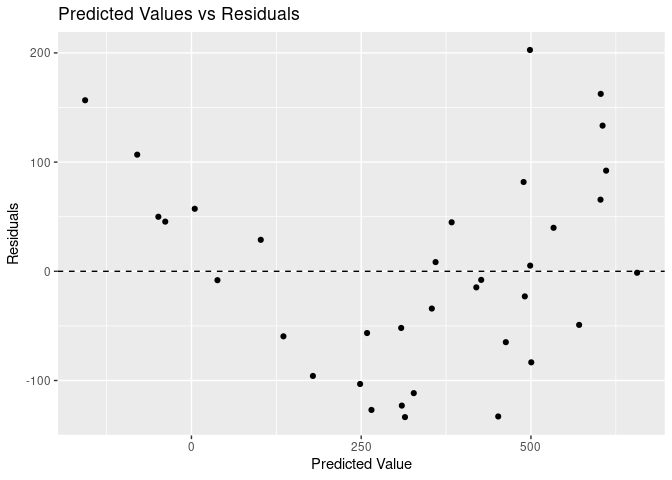<!-- -->
Here I’ve added a further predictor variable to the model, median
qualifying position per season.

This model has a higher adjusted R^2 (84.7%) than the previous 2
predictor variable model, but the plot of predicted values vs residuals
seems to show a v shaped pattern and as such a linear model may not be
suitable here.
