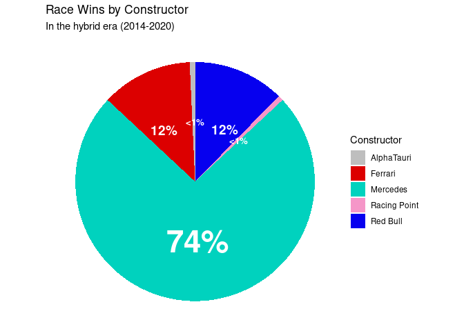
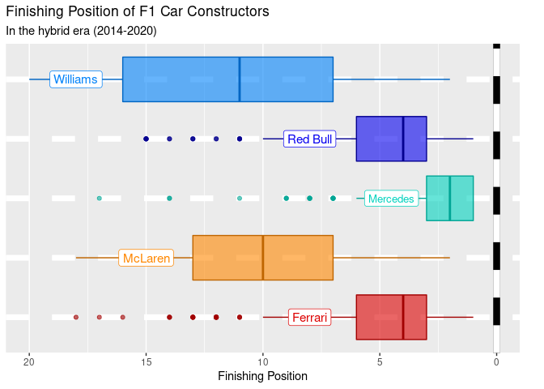
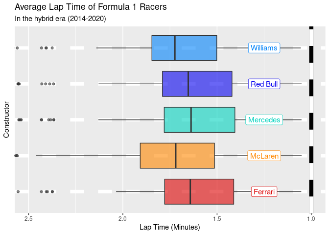
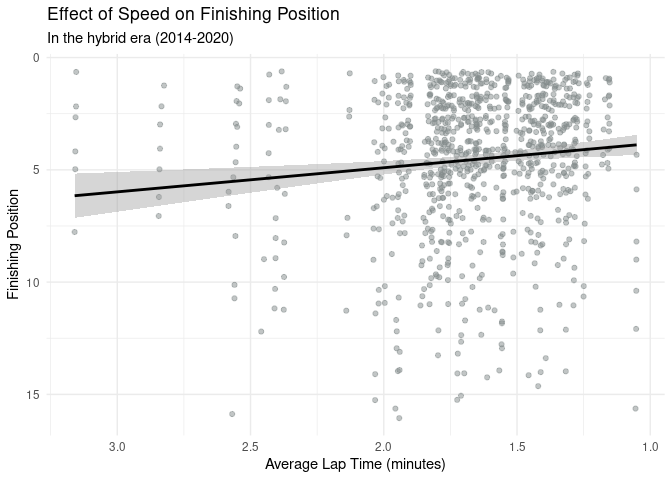
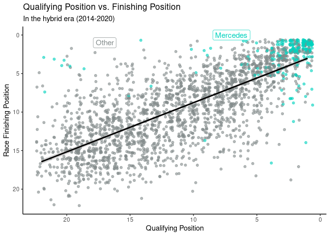
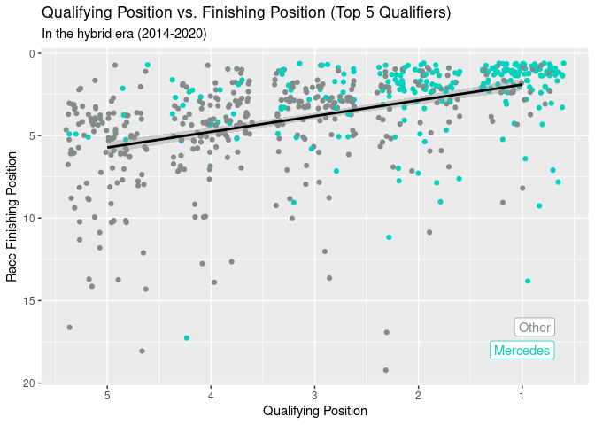
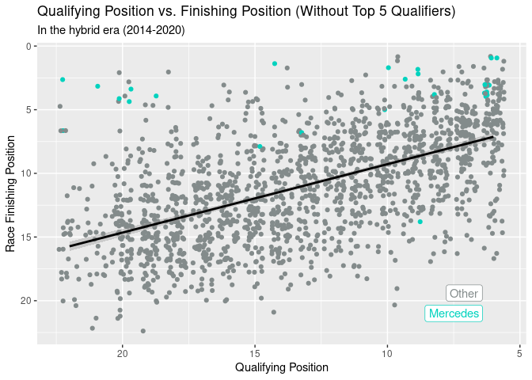
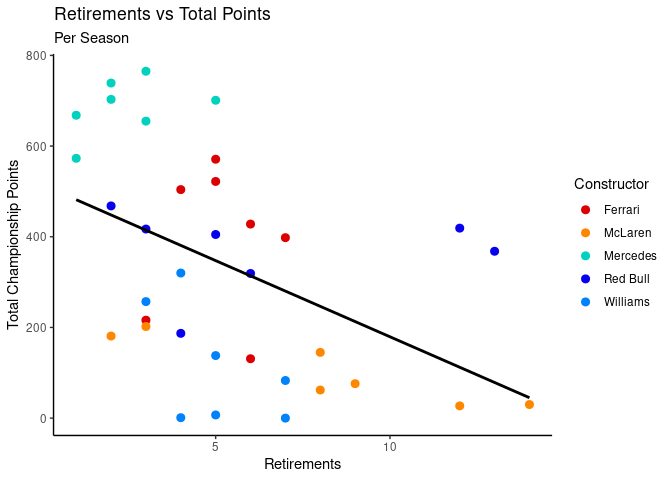
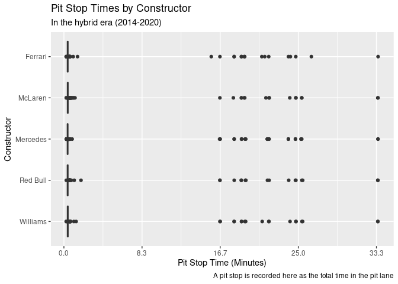
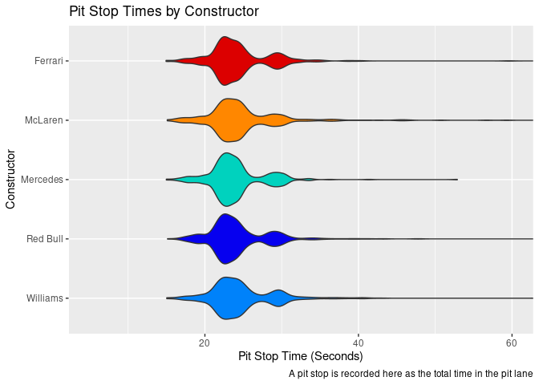

Visualisations Used in Presentation
================

## Dataset

### Wins Pie Chart

<!-- -->

### Finishing Position by Constructor Distribution

<!-- -->

## Speed

### Constructor’s Average Speeds

<!-- -->

### Average Lap Time vs Finishing Position

<!-- -->

## Qualifying

### Qualifying Position vs Finishing Position

<!-- -->

## Qualifying vs Finishing - Top 5

<!-- -->

### Qualifying vs Finishing - Rest

``` r
f1merged_hybrid %>%
  filter(!is.na(position) & grid > 5) %>%
  ggplot(aes(x = grid, y = position, color = constructorname == "Mercedes")) +
  geom_jitter() +
  geom_smooth(method = lm,
              formula = y ~ x,
              colour = "black") +
  labs(x = "Qualifying Position",
       y = "Race Finishing Position",
       title = "Qualifying Position vs. Finishing Position (Top 5 Qualifiers)",
       subtitle = "In the hybrid era (2014-2020)") +
  theme(legend.position = "none") +
  scale_color_manual(values = c("azure4","#00d2be")) +
  annotate(geom = "label", x = 7.5, y = 21, label = "Mercedes", 
           color = "#00d2be") +
  annotate(geom = "label", x = 7.1, y = 19.4, label = "Other", 
           color = "azure4") +
  scale_x_reverse() +
  scale_y_reverse()
```

<!-- -->

### Summary Statistics

    ## # A tibble: 5 × 3
    ##   constructorname race_wins percent
    ##   <chr>               <int>   <dbl>
    ## 1 AlphaTauri              1   0.725
    ## 2 Ferrari                17  12.3  
    ## 3 Mercedes              102  73.9  
    ## 4 Racing Point            1   0.725
    ## 5 Red Bull               17  12.3

    ## # A tibble: 5 × 3
    ##   constructorname pole_positions percent
    ##   <chr>                    <int>   <dbl>
    ## 1 Ferrari                     21  15.2  
    ## 2 Mercedes                   109  79.0  
    ## 3 Racing Point                 1   0.725
    ## 4 Red Bull                     6   4.35 
    ## 5 Williams                     1   0.725

## Reliability

### Retirements vs Points

<!-- -->

## Pit Stops

### Pit Stop Time vs Points per Season - skewed

<!-- -->

### Pit Stop Time vs Points per Season - red flags removed

<!-- -->
