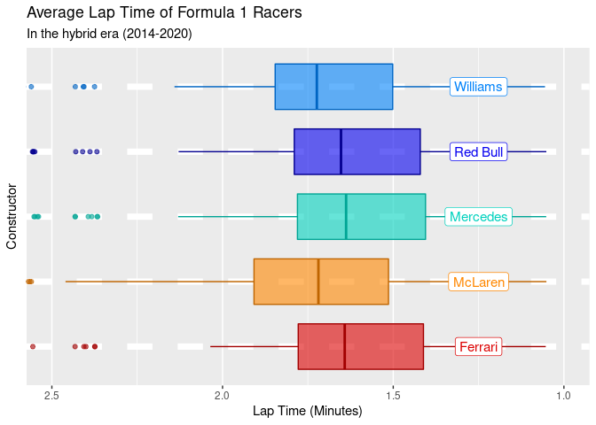
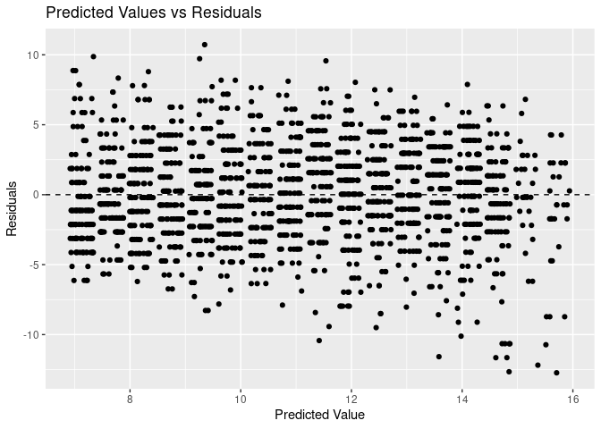
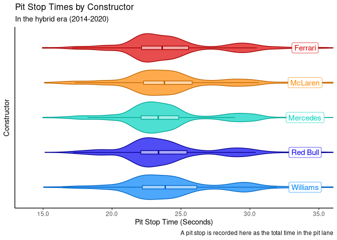

Visualisations Used in Presentation
================

## Dataset

### Wins Pie Chart

<!-- -->

### Finishing Position by Constructor Distribution

<!-- -->

## Speed

### Constructor’s Average Speeds

<!-- -->

### Average Lap Time vs Finishing Position

<!-- -->

## Qualifying

### Qualifying Position vs Finishing Position

<!-- -->

## Qualifying vs Finishing - Top 5

<!-- -->

    ## # A tibble: 2 × 5
    ##   term        estimate std.error statistic  p.value
    ##   <chr>          <dbl>     <dbl>     <dbl>    <dbl>
    ## 1 (Intercept)    0.954    0.244       3.91 1.04e- 4
    ## 2 grid           0.954    0.0747     12.8  2.84e-33

    ## # A tibble: 1 × 12
    ##   r.squared adj.r.squared sigma statistic  p.value    df logLik   AIC   BIC
    ##       <dbl>         <dbl> <dbl>     <dbl>    <dbl> <dbl>  <dbl> <dbl> <dbl>
    ## 1     0.209         0.208  2.61      163. 2.84e-33     1 -1468. 2943. 2956.
    ## # … with 3 more variables: deviance <dbl>, df.residual <int>, nobs <int>

<!-- -->

### Qualifying vs Finishing - Rest

<!-- -->

    ## # A tibble: 2 × 5
    ##   term        estimate std.error statistic   p.value
    ##   <chr>          <dbl>     <dbl>     <dbl>     <dbl>
    ## 1 (Intercept)    3.90     0.259       15.1 2.78e- 48
    ## 2 grid           0.537    0.0187      28.8 1.16e-148

    ## # A tibble: 1 × 12
    ##   r.squared adj.r.squared sigma statistic   p.value    df logLik   AIC   BIC
    ##       <dbl>         <dbl> <dbl>     <dbl>     <dbl> <dbl>  <dbl> <dbl> <dbl>
    ## 1     0.330         0.329  3.49      829. 1.16e-148     1 -4505. 9016. 9032.
    ## # … with 3 more variables: deviance <dbl>, df.residual <int>, nobs <int>

<!-- -->

### Summary Statistics

    ## # A tibble: 5 × 3
    ##   constructorname race_wins percent
    ##   <chr>               <int>   <dbl>
    ## 1 AlphaTauri              1   0.725
    ## 2 Ferrari                17  12.3  
    ## 3 Mercedes              102  73.9  
    ## 4 Racing Point            1   0.725
    ## 5 Red Bull               17  12.3

    ## # A tibble: 5 × 3
    ##   constructorname pole_positions percent
    ##   <chr>                    <int>   <dbl>
    ## 1 Ferrari                     21  15.2  
    ## 2 Mercedes                   109  79.0  
    ## 3 Racing Point                 1   0.725
    ## 4 Red Bull                     6   4.35 
    ## 5 Williams                     1   0.725

## Reliability

### Retirements vs Points

<!-- -->

## Pit Stops

### Pit Stop Time vs Points per Season - skewed

<!-- -->

### Pit Stop Time vs Points per Season - red flags removed

<!-- -->

### Pit Stop Time vs Points Per Season

<!-- -->

### Combined Model

    ## # A tibble: 3 × 5
    ##   term            estimate std.error statistic  p.value
    ##   <chr>              <dbl>     <dbl>     <dbl>    <dbl>
    ## 1 (Intercept)     6202.    1636.          3.79 0.000627
    ## 2 median_stoptime   -0.241    0.0692     -3.48 0.00148 
    ## 3 retirements      -35.0      9.60       -3.65 0.000928

    ## # A tibble: 1 × 12
    ##   r.squared adj.r.squared sigma statistic  p.value    df logLik   AIC   BIC
    ##       <dbl>         <dbl> <dbl>     <dbl>    <dbl> <dbl>  <dbl> <dbl> <dbl>
    ## 1     0.432         0.397  187.      12.2 0.000116     2  -231.  471.  477.
    ## # … with 3 more variables: deviance <dbl>, df.residual <int>, nobs <int>

<!-- -->
