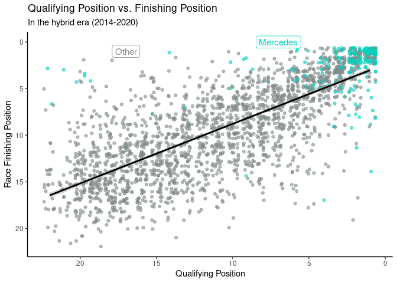
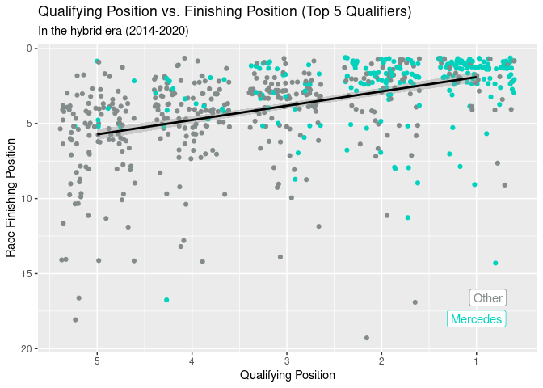
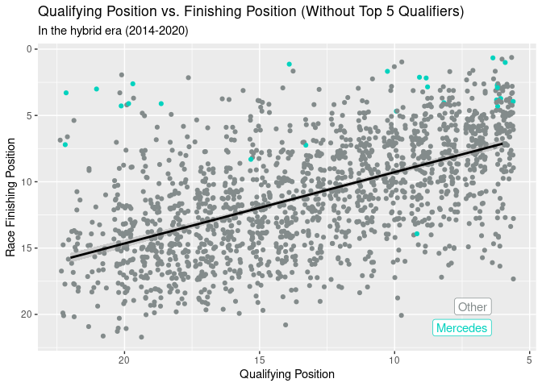

Visualisations Used in Presentation
================

## Dataset

### Wins Pie Chart

<!-- -->

### Finishing Position by Constructor Distribution

    ## Warning: Removed 199 rows containing non-finite values (stat_boxplot).

<!-- -->

## Speed

### Constructor’s Average Speeds

<!-- -->

### Average Lap Time vs Finishing Position

<!-- -->

## Qualifying

### Qualifying Position vs Finishing Position

<!-- -->

## Qualifying vs Finishing - Top 5

<!-- -->

### Qualifying vs Finishing - Rest

``` r
f1merged_hybrid %>%
  filter(!is.na(position) & grid > 5) %>%
  ggplot(aes(x = grid, y = position, color = constructorname == "Mercedes")) +
  geom_jitter() +
  geom_smooth(method = lm,
              formula = y ~ x,
              colour = "black") +
  labs(x = "Qualifying Position",
       y = "Race Finishing Position",
       title = "Qualifying Position vs. Finishing Position (Top 5 Qualifiers)",
       subtitle = "In the hybrid era (2014-2020)") +
  theme(legend.position = "none") +
  scale_color_manual(values = c("azure4","#00d2be")) +
  annotate(geom = "label", x = 7.5, y = 21, label = "Mercedes", 
           color = "#00d2be") +
  annotate(geom = "label", x = 7.1, y = 19.4, label = "Other", 
           color = "azure4")
```

<!-- -->

### Summary Statistics

**Put these here (I can’t find the code for this part)**

## Reliability

### Retirements vs Points

    ## Joining, by = c("year", "constructorname")

<!-- -->
