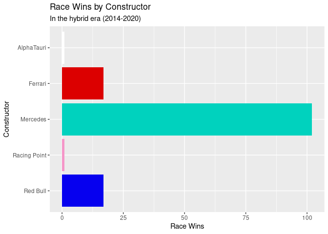

Rough Viz
================

``` r
library(tidyverse)
library(readr)
library(dplyr)
library(skimr)
library(here)
library(forcats)
library(tidymodels)
```

``` r
f1merged <- read_csv("/cloud/project/data/f1merged.csv")
f1merged_hybrid <- read_csv("/cloud/project/data/f1merged_hybrid.csv")
```

``` r
hybrid_era <- (2014:2020)
```

``` r
team_colours <- c("Mercedes" = "#00d2be",
                  "Red Bull" = "#0600ef",
                  "Ferrari" = "#dc0000",
                  "Racing Point" = "#F596C8",
                  "Force India" = "#f596c8",
                  "AlphaTauri" = "#ffffff",
                  "McLaren" = "#ff8700",
                  "Renault" = "#fff500",
                  "Williams" = "#0082fa",
                  "Toro Rosso" = "#469BFF",
                  "Lotus F1" = "#000000",
                  "Alfa Romeo" = "#960000",
                  "Sauber" = "#960000",
                  "Haas F1 Team" = "#787878")
                  


f1merged_hybrid %>%
  filter(positionText == 1) %>%
count(constructorname, sort = TRUE) %>% 
  ggplot(aes(x = n, 
             y = factor(constructorname, levels = rev(levels(factor(constructorname)))),
             fill = constructorname)) +
  geom_col(aes()) + 
 scale_fill_manual(values = team_colours) +
  labs(title = "Race Wins by Constructor",
       subtitle = "In the hybrid era (2014-2020)",
       x = "Race Wins",
      y = "Constructor") +
  guides(fill = "none")
```

<!-- -->

``` r
f1merged_hybrid %>%
  filter(positionText %in% 1:3) %>%
count(constructorname, sort = TRUE) %>% 
  ggplot(aes(x = n, 
             y = factor(constructorname, levels = rev(levels(factor(constructorname)))),
             fill = constructorname)) +
  geom_col(aes()) + 
 scale_fill_manual(values = team_colours) +
  labs(title = "Podium Finishes by Constructor",
       subtitle = "In the hybrid era (2014-2020)",
       x = "Podiums",
      y = "Constructor") + 
  guides(fill = "none")
```

<!-- -->

``` r
f1merged_hybrid %>%
  filter(grid == 1) %>%
count(constructorname, sort = TRUE) %>% 
  ggplot(aes(x = n, 
             y = factor(constructorname, levels = rev(levels(factor(constructorname)))),
             fill = constructorname)) +
  geom_col(aes()) + 
 scale_fill_manual(values = team_colours) +
  labs(title = "Pole Positions by Constructor",
       subtitle = "In the hybrid era (2014-2020)",
       x = "Pole Positions",
      y = "Constructor") + 
  guides(fill = "none")
```

<!-- -->

``` r
f1merged_hybrid %>%
  group_by(constructorname) %>%
  summarise(total_points = sum(points)) %>%
  filter(total_points > 5) %>%
   ggplot(aes(x = total_points, 
             y = factor(constructorname, levels = rev(levels(factor(constructorname)))),
             fill = constructorname)) +
  geom_col(aes()) + 
 scale_fill_manual(values = team_colours) +
  labs(title = "Total Championship Points by Constructor",
       subtitle = "In the hybrid era (2014-2020)",
       x = "Points",
      y = "Constructor") + 
  guides(fill = "none")
```

<!-- -->

``` r
#constructor_stats <- function(constructor) {

#f1merged_hybrid %>%
 # group_by(constructorname) %>%
  #filter(constructorname %in% key_teams) %>%
  #summarise(mean_grid_pos = mean(grid),
   #         mean_finish_pos = mean(position, na.rm = TRUE),
    #        mean_fl_rank = mean(rank, na.rm = TRUE),
     #       med_points = median(points),
      #      mean_points = (sum(points))/(n_distinct(f1merged_hybrid$raceId)))
            

#constructor_stats("Mercedes")
#constructor_stats("Ferrari")
#constructor_stats("Red Bull")
#constructor_stats("McLaren")
#constructor_stats("Williams")
```

``` r
f1merged_hybrid %>%
  filter(!is.na(position)) %>%
  ggplot(aes(x = grid, y = position)) +
  geom_jitter() +
  geom_smooth(method = lm) +
  labs(x = "Qualifying Position",
       y = "Race Finishing Position",
       title = "Qualifying Position vs. Finishing Position",
       subtitle = "In the hybrid era (2014-2020)")
```

    ## `geom_smooth()` using formula 'y ~ x'

<!-- -->

``` r
key_teams <- c("Ferrari", 
               "McLaren",
               "Mercedes",
               "Red Bull",
               "Williams")


f1merged_hybrid %>%
  group_by(constructorname) %>%
  filter(constructorname %in% key_teams & positionText == "R") %>%
  count(constructorname, sort = TRUE) %>%
  summarise(mean_ret_per_season = n/(n_distinct(f1merged_hybrid$year))) %>%
  ggplot(aes(x = mean_ret_per_season, 
             y = constructorname, 
             fill = constructorname)) +
  geom_col() + 
  scale_fill_manual(values = team_colours) +
  labs(x = "Mean Retirements Per Season",
       y = "Constructor",
       title = "Retirements Per Season by Constructor",
       subtitle = "In the Hybrid Era (2014-2020)") +
  guides(fill = "none")
```

<!-- -->

``` r
#looking at outliers
f1merged_hybrid %>%
  filter(grid == 0)
```

    ## # A tibble: 27 × 27
    ##    raceId  year round racename         date       driverId driverRef    surname 
    ##     <dbl> <dbl> <dbl> <chr>            <date>        <dbl> <chr>        <chr>   
    ##  1    931  2015     6 Monaco Grand Pr… 2015-05-24      832 sainz        Sainz   
    ##  2    926  2015     1 Australian Gran… 2015-03-15      822 bottas       Bottas  
    ##  3    927  2015     2 Malaysian Grand… 2015-03-29      829 stevens      Stevens 
    ##  4    953  2016     6 Monaco Grand Pr… 2016-05-29      830 max_verstap… Verstap…
    ##  5    953  2016     6 Monaco Grand Pr… 2016-05-29      831 nasr         Nasr    
    ##  6    956  2016     9 Austrian Grand … 2016-07-03       13 massa        Massa   
    ##  7    956  2016     9 Austrian Grand … 2016-07-03      826 kvyat        Kvyat   
    ##  8    969  2017     1 Australian Gran… 2017-03-26      817 ricciardo    Ricciar…
    ##  9    983  2017    15 Malaysian Grand… 2017-10-01        8 raikkonen    Räikkön…
    ## 10    998  2018    10 British Grand P… 2018-07-08      843 brendon_har… Hartley 
    ## # … with 17 more rows, and 19 more variables: constructorId <dbl>,
    ## #   constructorRef <chr>, constructorname <chr>, constructornat <chr>,
    ## #   resultId <dbl>, number <dbl>, grid <dbl>, position <dbl>,
    ## #   positionText <chr>, positionOrder <dbl>, points <dbl>, laps <dbl>,
    ## #   time <chr>, milliseconds <dbl>, fastestLap <dbl>, rank <dbl>,
    ## #   fastestLapTime <chr>, fastestLapSpeed <dbl>, statusId <dbl>

``` r
#Seem to be a small number of irregularities we can safely remove
```

``` r
quali_grid_tidy <- f1merged_hybrid %>%
  filter(!is.na(position) & grid != 0) 
 
  
  quali_grid_tidy %>%
   ggplot(aes(x = grid, y = position)) +
  geom_jitter() +
  geom_smooth(method = lm,
              formula = y ~ x) +
  labs(x = "Qualifying Position",
       y = "Race Finishing Position",
       title = "Qualifying Position vs. Finishing Position",
       subtitle = "In the hybrid era (2014-2020)") 
```

<!-- -->

``` r
posi_grid_fit <- linear_reg() %>%
  set_engine("lm") %>%
  fit(position ~ grid, data = quali_grid_tidy)

tidy(posi_grid_fit)
```

    ## # A tibble: 2 × 5
    ##   term        estimate std.error statistic  p.value
    ##   <chr>          <dbl>     <dbl>     <dbl>    <dbl>
    ## 1 (Intercept)    2.39     0.138       17.3 7.73e-63
    ## 2 grid           0.639    0.0115      55.4 0

``` r
glance(posi_grid_fit)
```

    ## # A tibble: 1 × 12
    ##   r.squared adj.r.squared sigma statistic p.value    df logLik    AIC    BIC
    ##       <dbl>         <dbl> <dbl>     <dbl>   <dbl> <dbl>  <dbl>  <dbl>  <dbl>
    ## 1     0.571         0.571  3.32     3067.       0     1 -6040. 12086. 12103.
    ## # … with 3 more variables: deviance <dbl>, df.residual <int>, nobs <int>

``` r
posi_grid_fit_aug <- augment(posi_grid_fit$fit)

posi_grid_fit_aug %>%
  ggplot(aes(x = .fitted, y = .resid)) + 
  geom_jitter() +
  geom_hline(yintercept = 0,
             linetype = "dashed") +
  labs(x = "Predicted Value",
       y = "Residuals",
       title = "Predicted Values vs Residuals")
```

<!-- -->

``` r
quali_grid_tidy_leaders <- quali_grid_tidy %>%
  filter(grid <=5)
 
  quali_grid_tidy_leaders %>%
   ggplot(aes(x = grid, y = position)) +
  geom_jitter() +
  geom_smooth(method = lm,
              formula = y ~ x) +
  labs(x = "Qualifying Position",
       y = "Race Finishing Position",
       title = "Qualifying Position vs. Finishing Position (Top 5 Qualifiers)",
       subtitle = "In the hybrid era (2014-2020)") 
```

<!-- -->

``` r
posi_grid_fit_leaders <- linear_reg() %>%
  set_engine("lm") %>%
  fit(position ~ grid, data = quali_grid_tidy_leaders)

tidy(posi_grid_fit_leaders)
```

    ## # A tibble: 2 × 5
    ##   term        estimate std.error statistic  p.value
    ##   <chr>          <dbl>     <dbl>     <dbl>    <dbl>
    ## 1 (Intercept)    0.954    0.244       3.91 1.04e- 4
    ## 2 grid           0.954    0.0747     12.8  2.84e-33

``` r
glance(posi_grid_fit_leaders)
```

    ## # A tibble: 1 × 12
    ##   r.squared adj.r.squared sigma statistic  p.value    df logLik   AIC   BIC
    ##       <dbl>         <dbl> <dbl>     <dbl>    <dbl> <dbl>  <dbl> <dbl> <dbl>
    ## 1     0.209         0.208  2.61      163. 2.84e-33     1 -1468. 2943. 2956.
    ## # … with 3 more variables: deviance <dbl>, df.residual <int>, nobs <int>

``` r
posi_grid_fit_leaders_aug <- augment(posi_grid_fit_leaders$fit)

posi_grid_fit_leaders_aug %>%
  ggplot(aes(x = .fitted, y = .resid)) + 
  geom_jitter() +
  geom_hline(yintercept = 0,
             linetype = "dashed") +
  labs(x = "Predicted Value",
       y = "Residuals",
       title = "Predicted Values vs Residuals")
```

<!-- -->

``` r
quali_grid_tidy_rest <- quali_grid_tidy %>%
  filter(grid >5)
 
  quali_grid_tidy_rest %>%
   ggplot(aes(x = grid, y = position)) +
  geom_jitter() +
  geom_smooth(method = lm,
              formula = y ~ x) +
  labs(x = "Qualifying Position",
       y = "Race Finishing Position",
       title = "Qualifying Position vs. Finishing Position (Without Top 5 Qualifiers)",
       subtitle = "In the hybrid era (2014-2020)") 
```

<!-- -->

``` r
posi_grid_fit_rest <- linear_reg() %>%
  set_engine("lm") %>%
  fit(position ~ grid, data = quali_grid_tidy_rest)

tidy(posi_grid_fit_rest)
```

    ## # A tibble: 2 × 5
    ##   term        estimate std.error statistic   p.value
    ##   <chr>          <dbl>     <dbl>     <dbl>     <dbl>
    ## 1 (Intercept)    3.90     0.259       15.1 2.78e- 48
    ## 2 grid           0.537    0.0187      28.8 1.16e-148

``` r
glance(posi_grid_fit_rest)
```

    ## # A tibble: 1 × 12
    ##   r.squared adj.r.squared sigma statistic   p.value    df logLik   AIC   BIC
    ##       <dbl>         <dbl> <dbl>     <dbl>     <dbl> <dbl>  <dbl> <dbl> <dbl>
    ## 1     0.330         0.329  3.49      829. 1.16e-148     1 -4505. 9016. 9032.
    ## # … with 3 more variables: deviance <dbl>, df.residual <int>, nobs <int>

``` r
posi_grid_fit_rest_aug <- augment(posi_grid_fit_rest$fit)

posi_grid_fit_rest_aug %>%
  ggplot(aes(x = .fitted, y = .resid)) + 
  geom_jitter() +
  geom_hline(yintercept = 0,
             linetype = "dashed") +
  labs(x = "Predicted Value",
       y = "Residuals",
       title = "Predicted Values vs Residuals")
```

<!-- -->

Models suggest a much stronger correlation between grid position and
finishing position for the drivers qualifying in the top 5.

If you qualify near the front you are likely to stay there, not as
strong a relationship further back in the field.

If you have one of the fastest cars and qualify near the front you are
likely to leave the rest of the field behind (better pace, not as likely
to be in someone’s dirty air) (also less likely to get involved in any
incidents/collisions, particularly at race start.) (All of these factors
would be strongest if you qualified P1)

Qualifying near the front of the grid is a very strong predictor of race
success. But of course having the clear fastest car would also correlate
very strongly with both of these.

``` r
f1merged_hybrid %>%
  mutate(mercedes_or_not = if_else
         (constructorname == "Mercedes",
                     true = "Mercedes",
                    false = "Everyone Else")) %>%
  filter(grid == 1) %>%
count(mercedes_or_not, sort = TRUE) %>% 
  ggplot(aes(x = n, 
             y = factor(mercedes_or_not, levels = rev(levels(factor(mercedes_or_not)))),
             fill = mercedes_or_not)) +
  geom_col(aes()) + 
 scale_fill_manual(values = team_colours) +
  labs(title = "Pole Positions by Constructor",
       subtitle = "In the hybrid era (2014-2020)",
       x = "Pole Positions",
      y = "Constructor") + 
  guides(fill = "none")
```

<!-- -->

``` r
f1merged_hybrid %>%
  mutate(mercedes_or_not = if_else
         (constructorname == "Mercedes",
                     true = "Mercedes",
                    false = "Everyone Else")) %>%
  filter(position == 1) %>%
count(mercedes_or_not, sort = TRUE) %>% 
  ggplot(aes(x = n, 
             y = factor(mercedes_or_not, levels = rev(levels(factor(mercedes_or_not)))),
             fill = mercedes_or_not)) +
  geom_col(aes()) + 
 scale_fill_manual(values = team_colours) +
  labs(title = "Race Wins by Constructor",
       subtitle = "In the hybrid era (2014-2020)",
       x = "Race Wins",
      y = "Constructor") + 
  guides(fill = "none")
```

<!-- -->
