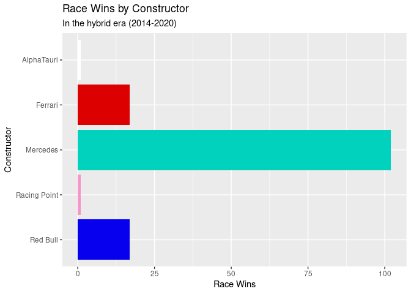

Project proposal
================
ECK

## 1. Introduction

We will be looking at the question **“What makes a successful Formula
One team?”**. In particular, we will look at Mercedes-AMG Petronas F1
Team, and their success in the hybrid era (2014-2020\*).

The data we are using comes from the Ergast Developer API
(**<http://ergast.com/mrd/>**). It provides data for the Formula One
(F1) racing series from 1950 to present. The data is collected from
official race classifications released by the FIA, Formula One’s
governing body.

Much of our analysis will focus on the *f1merged* dataframe, which
combines relevant data from the results, races, drivers & constructors
data frames. Each observation in this dataframe represents the result of
one driver at one race.

Variables in this data frame include:

-   Unique ID numbers and identifiers for each result, race, driver and
    constructor.
-   The year/season, round number, date and name of each race.
-   Driver names and numbers. Constructor names and nationalities.
-   Starting and finishing positions for each driver.
-   Laps completed, points gained, finishing time.
-   Fastest lap time, fastest lap speed and fastest lap ranking.
-   Status ID, which links to a data frame with detailed finishing
    statuses.

We will also look at the *qualifying* data frame, with variables for
race, driver, constructor and qualifying position, as well as fastest
lap times from each qualifying session.

Similarly we will use the *pit\_stops* data frame, with variables for
race, driver, stop number, lap number, time of the pit stop and duration
of the pit stop.

\**The 2021 season is excluded from our analysis because it is still
ongoing at the time of writing*.

## 2. Data

For this project, we will be using a combination of data frames from the
Formula One data set. The combined data frame *f1merged* will give us
the variables referenced above in the **Introduction** section.

Here is a glimpse and skim of the *f1merged* data frame.

    ## Rows: 25280 Columns: 27

    ## ── Column specification ────────────────────────────────────────────────────────
    ## Delimiter: ","
    ## chr   (9): racename, driverRef, surname, constructorRef, constructorname, co...
    ## dbl  (17): raceId, year, round, driverId, constructorId, resultId, number, g...
    ## date  (1): date

    ## 
    ## ℹ Use `spec()` to retrieve the full column specification for this data.
    ## ℹ Specify the column types or set `show_col_types = FALSE` to quiet this message.

    ## Rows: 2827 Columns: 27

    ## ── Column specification ────────────────────────────────────────────────────────
    ## Delimiter: ","
    ## chr   (9): racename, driverRef, surname, constructorRef, constructorname, co...
    ## dbl  (17): raceId, year, round, driverId, constructorId, resultId, number, g...
    ## date  (1): date

    ## 
    ## ℹ Use `spec()` to retrieve the full column specification for this data.
    ## ℹ Specify the column types or set `show_col_types = FALSE` to quiet this message.

    ## Rows: 25,280
    ## Columns: 27
    ## $ raceId          <dbl> 1, 1, 1, 1, 1, 1, 1, 1, 1, 1, 1, 1, 1, 1, 1, 1, 1, 1, …
    ## $ year            <dbl> 2009, 2009, 2009, 2009, 2009, 2009, 2009, 2009, 2009, …
    ## $ round           <dbl> 1, 1, 1, 1, 1, 1, 1, 1, 1, 1, 1, 1, 1, 1, 1, 1, 1, 1, …
    ## $ racename        <chr> "Australian Grand Prix", "Australian Grand Prix", "Aus…
    ## $ date            <date> 2009-03-29, 2009-03-29, 2009-03-29, 2009-03-29, 2009-…
    ## $ driverId        <dbl> 1, 2, 3, 4, 5, 6, 7, 8, 9, 10, 12, 13, 15, 16, 17, 18,…
    ## $ driverRef       <chr> "hamilton", "heidfeld", "rosberg", "alonso", "kovalain…
    ## $ surname         <chr> "Hamilton", "Heidfeld", "Rosberg", "Alonso", "Kovalain…
    ## $ constructorId   <dbl> 1, 2, 3, 4, 1, 3, 5, 6, 2, 7, 4, 6, 7, 10, 9, 23, 9, 1…
    ## $ constructorRef  <chr> "mclaren", "bmw_sauber", "williams", "renault", "mclar…
    ## $ constructorname <chr> "McLaren", "BMW Sauber", "Williams", "Renault", "McLar…
    ## $ constructornat  <chr> "British", "German", "British", "French", "British", "…
    ## $ resultId        <dbl> 7573, 7563, 7559, 7558, 7572, 7571, 7561, 7568, 7567, …
    ## $ number          <dbl> 1, 6, 16, 7, 2, 17, 11, 4, 5, 10, 8, 3, 9, 20, 14, 22,…
    ## $ grid            <dbl> 18, 9, 5, 10, 12, 11, 17, 7, 4, 19, 14, 6, 20, 16, 8, …
    ## $ position        <dbl> NA, 10, 6, 5, NA, NA, 8, 15, 14, 4, NA, NA, 3, 9, 12, …
    ## $ positionText    <chr> "D", "10", "6", "5", "R", "R", "8", "15", "14", "4", "…
    ## $ positionOrder   <dbl> 20, 10, 6, 5, 19, 18, 8, 15, 14, 4, 17, 16, 3, 9, 12, …
    ## $ points          <dbl> 0.0, 0.0, 3.0, 4.0, 0.0, 0.0, 1.0, 0.0, 0.0, 5.0, 0.0,…
    ## $ laps            <dbl> 58, 58, 58, 58, 0, 17, 58, 55, 55, 58, 24, 45, 58, 58,…
    ## $ time            <chr> NA, "+7.085", "+5.722", "+4.879", NA, NA, "+6.298", NA…
    ## $ milliseconds    <dbl> NA, 5662869, 5661506, 5660663, NA, NA, 5662082, NA, NA…
    ## $ fastestLap      <dbl> 39, 48, 48, 53, NA, 6, 50, 35, 36, 53, 17, 30, 50, 43,…
    ## $ rank            <dbl> 13, 5, 1, 9, NA, 18, 17, 7, 2, 6, 19, 15, 10, 11, 8, 3…
    ## $ fastestLapTime  <chr> "1:29.020", "1:28.283", "1:27.706", "1:28.712", NA, "1…
    ## $ fastestLapSpeed <dbl> 214.455, 216.245, 217.668, 215.199, NA, 212.301, 212.5…
    ## $ statusId        <dbl> 2, 1, 1, 1, 4, 3, 1, 24, 4, 1, 20, 22, 1, 1, 11, 1, 4,…

|                                                  |          |
|:-------------------------------------------------|:---------|
| Name                                             | f1merged |
| Number of rows                                   | 25280    |
| Number of columns                                | 27       |
| \_\_\_\_\_\_\_\_\_\_\_\_\_\_\_\_\_\_\_\_\_\_\_   |          |
| Column type frequency:                           |          |
| character                                        | 9        |
| Date                                             | 1        |
| numeric                                          | 17       |
| \_\_\_\_\_\_\_\_\_\_\_\_\_\_\_\_\_\_\_\_\_\_\_\_ |          |
| Group variables                                  | None     |

Data summary

**Variable type: character**

| skim\_variable  | n\_missing | complete\_rate | min | max | empty | n\_unique | whitespace |
|:----------------|-----------:|---------------:|----:|----:|------:|----------:|-----------:|
| racename        |          0 |           1.00 |  16 |  29 |     0 |        48 |          0 |
| driverRef       |          0 |           1.00 |   3 |  18 |     0 |       853 |          0 |
| surname         |          0 |           1.00 |   3 |  23 |     0 |       794 |          0 |
| constructorRef  |          0 |           1.00 |   2 |  20 |     0 |       210 |          0 |
| constructorname |          0 |           1.00 |   2 |  25 |     0 |       210 |          0 |
| constructornat  |          0 |           1.00 |   5 |  13 |     0 |        24 |          0 |
| positionText    |          0 |           1.00 |   1 |   2 |     0 |        39 |          0 |
| time            |      18521 |           0.27 |   4 |  11 |     0 |      6522 |          0 |
| fastestLapTime  |      18444 |           0.27 |   7 |   8 |     0 |      6312 |          0 |

**Variable type: Date**

| skim\_variable | n\_missing | complete\_rate | min        | max        | median     | n\_unique |
|:---------------|-----------:|---------------:|:-----------|:-----------|:-----------|----------:|
| date           |          0 |              1 | 1950-05-13 | 2021-10-10 | 1990-07-01 |      1051 |

**Variable type: numeric**

| skim\_variable  | n\_missing | complete\_rate |       mean |         sd |        p0 |        p25 |        p50 |        p75 |        p100 | hist  |
|:----------------|-----------:|---------------:|-----------:|-----------:|----------:|-----------:|-----------:|-----------:|------------:|:------|
| raceId          |          0 |           1.00 |     519.25 |     291.22 |      1.00 |     288.00 |     504.00 |     764.00 |     1067.00 | ▆▇▇▆▆ |
| year            |          0 |           1.00 |    1989.55 |      18.97 |   1950.00 |    1976.00 |    1990.00 |    2006.00 |     2021.00 | ▃▆▇▆▇ |
| round           |          0 |           1.00 |       8.28 |       4.86 |      1.00 |       4.00 |       8.00 |      12.00 |       21.00 | ▇▆▅▃▁ |
| driverId        |          0 |           1.00 |     251.84 |     259.27 |      1.00 |      56.00 |     159.00 |     347.00 |      854.00 | ▇▃▂▁▂ |
| constructorId   |          0 |           1.00 |      47.59 |      58.53 |      1.00 |       6.00 |      25.00 |      58.00 |      214.00 | ▇▂▁▁▁ |
| resultId        |          0 |           1.00 |   12641.24 |    7298.91 |      1.00 |    6320.75 |   12640.50 |   18960.25 |    25285.00 | ▇▇▇▇▇ |
| number          |          6 |           1.00 |      17.62 |      14.85 |      0.00 |       7.00 |      15.00 |      23.00 |      208.00 | ▇▁▁▁▁ |
| grid            |          0 |           1.00 |      11.20 |       7.27 |      0.00 |       5.00 |      11.00 |      17.00 |       34.00 | ▇▇▇▃▁ |
| position        |      10768 |           0.57 |       7.91 |       4.79 |      1.00 |       4.00 |       7.00 |      11.00 |       33.00 | ▇▆▂▁▁ |
| positionOrder   |          0 |           1.00 |      12.93 |       7.74 |      1.00 |       6.00 |      12.00 |      19.00 |       39.00 | ▇▇▆▂▁ |
| points          |          0 |           1.00 |       1.81 |       4.05 |      0.00 |       0.00 |       0.00 |       2.00 |       50.00 | ▇▁▁▁▁ |
| laps            |          0 |           1.00 |      45.80 |      30.01 |      0.00 |      21.00 |      52.00 |      66.00 |      200.00 | ▅▇▁▁▁ |
| milliseconds    |      18522 |           0.27 | 6232734.40 | 1691425.64 | 207071.00 | 5410837.50 | 5812935.50 | 6432545.00 | 15090540.00 | ▁▇▃▁▁ |
| fastestLap      |      18444 |           0.27 |      42.28 |      16.95 |      2.00 |      32.00 |      45.00 |      54.00 |       85.00 | ▂▃▇▆▁ |
| rank            |      18249 |           0.28 |      10.45 |       6.19 |      0.00 |       5.00 |      10.00 |      16.00 |       24.00 | ▇▇▇▇▂ |
| fastestLapSpeed |      18444 |           0.27 |     202.74 |      21.35 |     89.54 |     192.53 |     204.13 |     215.75 |      257.32 | ▁▁▂▇▂ |
| statusId        |          0 |           1.00 |      17.70 |      26.09 |      1.00 |       1.00 |      11.00 |      14.00 |      139.00 | ▇▁▁▁▁ |

It’s perhaps worth noting that the large number of NA values in this
data frame do not signify errors in the data.

An NA value in the *position* column represents a driver that did not
finish that race, and data on individual lap times and speeds was not
available for much of F1’s history.

## 3. Data analysis plan

The plan for this data analysis is to explore the question  
**“What makes a successful Formula One (F1) team?”**

There’s no questioning Mercedes-AMG Petronas F1 Team as the most
successful constructor of the hybrid era.

They have won the World Constructor’s and Driver’s Championships seven
years running.

They boast an overwhelming majority of all race wins:
<!-- -->

and pole positions (1st place in the Saturday qualifying session):

<!-- -->

We want to look at what factors play into this
