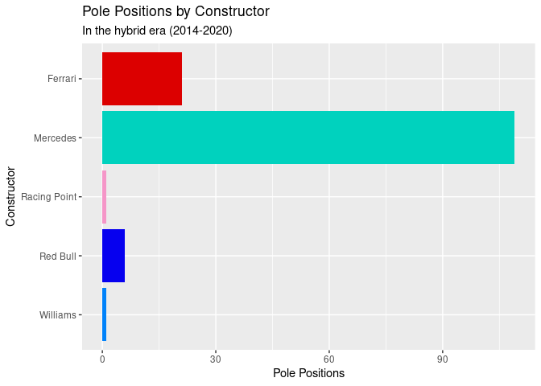
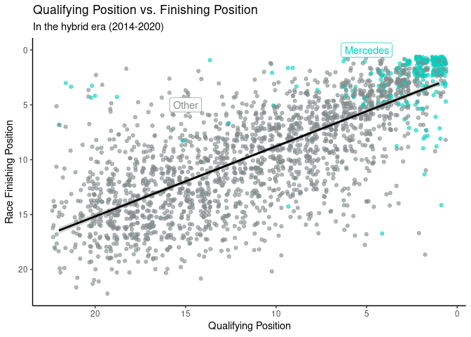

Project proposal
================
ECK

``` r
library(tidyverse)
library(broom)
library(here)
library(skimr)
library(glue)
library(forcats)
```

## 1. Introduction

We will be looking at the question **“What makes a successful Formula
One team?”**. In particular, we will look at Mercedes-AMG Petronas F1
Team, and their success in the hybrid era (2014-2020\*).

The data we are using comes from the Ergast Developer API
(**<http://ergast.com/mrd/>**). It provides data for the Formula One
(F1) racing series from 1950 to present. The data is collected from
official race classifications released by the FIA, Formula One’s
governing body.

Much of our analysis will focus on the *f1merged* dataframe, which
combines relevant data from the results, races, drivers & constructors
data frames. Each observation in this dataframe represents the result of
one driver at one race.

Variables in this data frame include:

-   Unique ID numbers and identifiers for each result, race, driver and
    constructor.
-   The year/season, round number, date and name of each race.
-   Driver names and numbers. Constructor names and nationalities.
-   Starting and finishing positions for each driver.
-   Laps completed, points gained, finishing time.
-   Fastest lap time, fastest lap speed and fastest lap ranking.
-   Status ID, which links to a data frame with detailed finishing
    statuses.

We will also look at the *qualifying* data frame, with variables for
race, driver, constructor and qualifying position, as well as fastest
lap times from each qualifying session.

Similarly we will use the *pit\_stops* data frame, with variables for
race, driver, stop number, lap number, time of the pit stop and duration
of the pit stop.

\**The 2021 season is excluded from our analysis because it is still
ongoing at the time of writing*.

## 2. Data

For this project, we will be using a combination of data frames from the
Formula One data set. The combined data frame *f1merged* will give us
the variables referenced above in the **Introduction** section.

Here is a glimpse and skim of the *f1merged* data frame.

``` r
f1merged <- read_csv("/cloud/project/data/f1merged.csv")
f1merged_hybrid <- read_csv("/cloud/project/data/f1merged_hybrid.csv")

glimpse(f1merged)
```

    ## Rows: 25,280
    ## Columns: 27
    ## $ raceId          <dbl> 1, 1, 1, 1, 1, 1, 1, 1, 1, 1, 1, 1, 1, 1, 1, 1, 1, 1, …
    ## $ year            <dbl> 2009, 2009, 2009, 2009, 2009, 2009, 2009, 2009, 2009, …
    ## $ round           <dbl> 1, 1, 1, 1, 1, 1, 1, 1, 1, 1, 1, 1, 1, 1, 1, 1, 1, 1, …
    ## $ racename        <chr> "Australian Grand Prix", "Australian Grand Prix", "Aus…
    ## $ date            <date> 2009-03-29, 2009-03-29, 2009-03-29, 2009-03-29, 2009-…
    ## $ driverId        <dbl> 1, 2, 3, 4, 5, 6, 7, 8, 9, 10, 12, 13, 15, 16, 17, 18,…
    ## $ driverRef       <chr> "hamilton", "heidfeld", "rosberg", "alonso", "kovalain…
    ## $ surname         <chr> "Hamilton", "Heidfeld", "Rosberg", "Alonso", "Kovalain…
    ## $ constructorId   <dbl> 1, 2, 3, 4, 1, 3, 5, 6, 2, 7, 4, 6, 7, 10, 9, 23, 9, 1…
    ## $ constructorRef  <chr> "mclaren", "bmw_sauber", "williams", "renault", "mclar…
    ## $ constructorname <chr> "McLaren", "BMW Sauber", "Williams", "Renault", "McLar…
    ## $ constructornat  <chr> "British", "German", "British", "French", "British", "…
    ## $ resultId        <dbl> 7573, 7563, 7559, 7558, 7572, 7571, 7561, 7568, 7567, …
    ## $ number          <dbl> 1, 6, 16, 7, 2, 17, 11, 4, 5, 10, 8, 3, 9, 20, 14, 22,…
    ## $ grid            <dbl> 18, 9, 5, 10, 12, 11, 17, 7, 4, 19, 14, 6, 20, 16, 8, …
    ## $ position        <dbl> NA, 10, 6, 5, NA, NA, 8, 15, 14, 4, NA, NA, 3, 9, 12, …
    ## $ positionText    <chr> "D", "10", "6", "5", "R", "R", "8", "15", "14", "4", "…
    ## $ positionOrder   <dbl> 20, 10, 6, 5, 19, 18, 8, 15, 14, 4, 17, 16, 3, 9, 12, …
    ## $ points          <dbl> 0.0, 0.0, 3.0, 4.0, 0.0, 0.0, 1.0, 0.0, 0.0, 5.0, 0.0,…
    ## $ laps            <dbl> 58, 58, 58, 58, 0, 17, 58, 55, 55, 58, 24, 45, 58, 58,…
    ## $ time            <chr> NA, "+7.085", "+5.722", "+4.879", NA, NA, "+6.298", NA…
    ## $ milliseconds    <dbl> NA, 5662869, 5661506, 5660663, NA, NA, 5662082, NA, NA…
    ## $ fastestLap      <dbl> 39, 48, 48, 53, NA, 6, 50, 35, 36, 53, 17, 30, 50, 43,…
    ## $ rank            <dbl> 13, 5, 1, 9, NA, 18, 17, 7, 2, 6, 19, 15, 10, 11, 8, 3…
    ## $ fastestLapTime  <chr> "1:29.020", "1:28.283", "1:27.706", "1:28.712", NA, "1…
    ## $ fastestLapSpeed <dbl> 214.455, 216.245, 217.668, 215.199, NA, 212.301, 212.5…
    ## $ statusId        <dbl> 2, 1, 1, 1, 4, 3, 1, 24, 4, 1, 20, 22, 1, 1, 11, 1, 4,…

``` r
skim(f1merged)
```

|                                                  |          |
|:-------------------------------------------------|:---------|
| Name                                             | f1merged |
| Number of rows                                   | 25280    |
| Number of columns                                | 27       |
| \_\_\_\_\_\_\_\_\_\_\_\_\_\_\_\_\_\_\_\_\_\_\_   |          |
| Column type frequency:                           |          |
| character                                        | 9        |
| Date                                             | 1        |
| numeric                                          | 17       |
| \_\_\_\_\_\_\_\_\_\_\_\_\_\_\_\_\_\_\_\_\_\_\_\_ |          |
| Group variables                                  | None     |

Data summary

**Variable type: character**

| skim\_variable  | n\_missing | complete\_rate | min | max | empty | n\_unique | whitespace |
|:----------------|-----------:|---------------:|----:|----:|------:|----------:|-----------:|
| racename        |          0 |           1.00 |  16 |  29 |     0 |        48 |          0 |
| driverRef       |          0 |           1.00 |   3 |  18 |     0 |       853 |          0 |
| surname         |          0 |           1.00 |   3 |  23 |     0 |       794 |          0 |
| constructorRef  |          0 |           1.00 |   2 |  20 |     0 |       210 |          0 |
| constructorname |          0 |           1.00 |   2 |  25 |     0 |       210 |          0 |
| constructornat  |          0 |           1.00 |   5 |  13 |     0 |        24 |          0 |
| positionText    |          0 |           1.00 |   1 |   2 |     0 |        39 |          0 |
| time            |      18521 |           0.27 |   4 |  11 |     0 |      6522 |          0 |
| fastestLapTime  |      18444 |           0.27 |   7 |   8 |     0 |      6312 |          0 |

**Variable type: Date**

| skim\_variable | n\_missing | complete\_rate | min        | max        | median     | n\_unique |
|:---------------|-----------:|---------------:|:-----------|:-----------|:-----------|----------:|
| date           |          0 |              1 | 1950-05-13 | 2021-10-10 | 1990-07-01 |      1051 |

**Variable type: numeric**

| skim\_variable  | n\_missing | complete\_rate |       mean |         sd |        p0 |        p25 |        p50 |        p75 |        p100 | hist  |
|:----------------|-----------:|---------------:|-----------:|-----------:|----------:|-----------:|-----------:|-----------:|------------:|:------|
| raceId          |          0 |           1.00 |     519.25 |     291.22 |      1.00 |     288.00 |     504.00 |     764.00 |     1067.00 | ▆▇▇▆▆ |
| year            |          0 |           1.00 |    1989.55 |      18.97 |   1950.00 |    1976.00 |    1990.00 |    2006.00 |     2021.00 | ▃▆▇▆▇ |
| round           |          0 |           1.00 |       8.28 |       4.86 |      1.00 |       4.00 |       8.00 |      12.00 |       21.00 | ▇▆▅▃▁ |
| driverId        |          0 |           1.00 |     251.84 |     259.27 |      1.00 |      56.00 |     159.00 |     347.00 |      854.00 | ▇▃▂▁▂ |
| constructorId   |          0 |           1.00 |      47.59 |      58.53 |      1.00 |       6.00 |      25.00 |      58.00 |      214.00 | ▇▂▁▁▁ |
| resultId        |          0 |           1.00 |   12641.24 |    7298.91 |      1.00 |    6320.75 |   12640.50 |   18960.25 |    25285.00 | ▇▇▇▇▇ |
| number          |          6 |           1.00 |      17.62 |      14.85 |      0.00 |       7.00 |      15.00 |      23.00 |      208.00 | ▇▁▁▁▁ |
| grid            |          0 |           1.00 |      11.20 |       7.27 |      0.00 |       5.00 |      11.00 |      17.00 |       34.00 | ▇▇▇▃▁ |
| position        |      10768 |           0.57 |       7.91 |       4.79 |      1.00 |       4.00 |       7.00 |      11.00 |       33.00 | ▇▆▂▁▁ |
| positionOrder   |          0 |           1.00 |      12.93 |       7.74 |      1.00 |       6.00 |      12.00 |      19.00 |       39.00 | ▇▇▆▂▁ |
| points          |          0 |           1.00 |       1.81 |       4.05 |      0.00 |       0.00 |       0.00 |       2.00 |       50.00 | ▇▁▁▁▁ |
| laps            |          0 |           1.00 |      45.80 |      30.01 |      0.00 |      21.00 |      52.00 |      66.00 |      200.00 | ▅▇▁▁▁ |
| milliseconds    |      18522 |           0.27 | 6232734.40 | 1691425.64 | 207071.00 | 5410837.50 | 5812935.50 | 6432545.00 | 15090540.00 | ▁▇▃▁▁ |
| fastestLap      |      18444 |           0.27 |      42.28 |      16.95 |      2.00 |      32.00 |      45.00 |      54.00 |       85.00 | ▂▃▇▆▁ |
| rank            |      18249 |           0.28 |      10.45 |       6.19 |      0.00 |       5.00 |      10.00 |      16.00 |       24.00 | ▇▇▇▇▂ |
| fastestLapSpeed |      18444 |           0.27 |     202.74 |      21.35 |     89.54 |     192.53 |     204.13 |     215.75 |      257.32 | ▁▁▂▇▂ |
| statusId        |          0 |           1.00 |      17.70 |      26.09 |      1.00 |       1.00 |      11.00 |      14.00 |      139.00 | ▇▁▁▁▁ |

It’s perhaps worth noting that the large number of NA values in this
data frame do not signify errors in the data.

An NA value in the *position* column represents a driver that did not
finish that race, and data on individual lap times and speeds was not
available for much of F1’s history.

## 3. Data analysis plan

The plan for this data analysis is to explore the question  
**“What makes a successful Formula One (F1) team?”**

There’s no questioning Mercedes-AMG Petronas F1 Team as the most
successful constructor of the hybrid era.

They have won the World Constructor’s and Driver’s Championships seven
years running.

They boast an overwhelming majority of all **race wins**:

``` r
team_colours <- c("Mercedes" = "#00d2be",
                  "Red Bull" = "#0600ef",
                  "Ferrari" = "#dc0000",
                  "Racing Point" = "#F596C8",
                  "Force India" = "#f596c8",
                  "AlphaTauri" = "#ffffff",
                  "McLaren" = "#ff8700",
                  "Renault" = "#fff500",
                  "Williams" = "#0082fa",
                  "Toro Rosso" = "#469BFF",
                  "Lotus F1" = "#000000",
                  "Alfa Romeo" = "#960000",
                  "Sauber" = "#960000",
                  "Haas F1 Team" = "#787878")

key_teams <- c("Ferrari", 
               "McLaren",
               "Mercedes",
               "Red Bull",
               "Williams")

f1merged_hybrid %>%
  filter(positionText == 1) %>%
count(constructorname, sort = TRUE) %>% 
  ggplot(aes(x = n, 
             y = factor(constructorname, levels = rev(levels(factor(constructorname)))),
             fill = constructorname)) +
  geom_col(aes()) + 
 scale_fill_manual(values = team_colours) +
  labs(title = "Race Wins by Constructor",
       subtitle = "In the hybrid era (2014-2020)",
       x = "Race Wins",
      y = "Constructor") +
  guides(fill = "none")
```

<!-- -->

and **pole positions** (1st place in the Saturday qualifying session):

``` r
f1merged_hybrid %>%
  filter(grid == 1) %>%
count(constructorname, sort = TRUE) %>% 
  ggplot(aes(x = n, 
             y = factor(constructorname, levels = rev(levels(factor(constructorname)))),
             fill = constructorname)) +
  geom_col(aes()) + 
 scale_fill_manual(values = team_colours) +
  labs(title = "Pole Positions by Constructor",
       subtitle = "In the hybrid era (2014-2020)",
       x = "Pole Positions",
      y = "Constructor") + 
  guides(fill = "none")
```

<!-- -->

We want to look at what goes into this success; Is it sufficient to
simply have the fastest car in the race? Or do other factors, such as
reliability, pit stop times and qualifying performance make a
significant impact?

**How important is qualifying position as far as race results are
concerned?**

We want to see how closely tied starting grid position is to finishing
position. Can a good race on a Sunday make up for a bad qualifying
session on Saturday? Or is a solid qualifying performance vital to a
strong race?

``` r
f1merged_hybrid %>%
  filter(!is.na(position)) %>%
  ggplot(aes(x = grid, y = position)) +
  geom_jitter() +
  geom_smooth(method = lm) +
  labs(x = "Qualifying Position",
       y = "Race Finishing Position",
       title = "Qualifying Position vs. Finishing Position",
       subtitle = "In the hybrid era (2014-2020)") +
  scale_y_reverse() +
  scale_x_reverse()
```

<!-- -->

Here we will use the predictor variable *“grid”*,which represents
qualifying position, and the outcome variable *“position”* , reflecting
finishing race position in the race.

A strong correlation between the two would suggest that making up places
in the race is difficult, and qualifying is very important for success.
A weaker link would suggest other factors such as race pace, pit stop
times and strategies, and mechanical reliability are more important.

We would expect the two to be strong correlated, the aerodynamics of
current F1 cars create “dirty air” behind them that makes closely
following and overtaking very difficult. As such we would expect
qualifying position to be closely tied to finishing position.

Once we have more of an answer to our question we could look at Mercedes
in qualifying specifically, and how they compare to other teams.

**How does the number of retirements per season correlate with points
won?**

We want to look at reliability, and how it relates to Formula 1 success.
Would a team with a faster, but much less reliable car, see more success
than one with a slower, but less retirement prone car? To what extent is
mechanical reliability a predictor of strong results across a season?

``` r
f1merged_hybrid %>%
  group_by(constructorname) %>%
  filter(constructorname %in% key_teams & positionText == "R") %>%
  count(constructorname, sort = TRUE) %>%
  summarise(mean_ret_per_season = n/(n_distinct(f1merged_hybrid$year))) %>%
  ggplot(aes(x = mean_ret_per_season, 
             y = constructorname, 
             fill = constructorname)) +
  geom_col() + 
  scale_fill_manual(values = team_colours) +
  labs(x = "Mean Retirements Per Season",
       y = "Constructor",
       title = "Retirements Per Season by Constructor",
       subtitle = "In the Hybrid Era (2014-2020)") +
  guides(fill = "none")
```

<!-- -->

Our predictor variable for this will be *“retirements per season”*, our
outcome variable will be *“points per season”*. A strong negative trend
between the two would suggest that a less reliable car leads to fewer
points scored. We would expect this to be the case, a retirement always
scores you 0 points, but it is possible that a team can make up for a
certain number of retirements over a season with a fast enough car.

As you can see from the visualization above, Mercedes have by far the
lowest average retirements per season in our comparison group. As such,
if our hypothesis is correct it could explain part of their success.

-   *Note - race retirements for any reason, mechanical or otherwise,
    are not (clearly) differentiated in this data set so this is not a
    perfect metric for reliability. If possible we will attempt to
    separate these out in our analysis*

**How do pit stop times correlate with places gained?**

We will use the predictor variable of *“mean pit stop time per race”*
and the outcome variable *“places gained per race”*.

A Formula 1 pit stop is typically under 3 seconds and tiny margins
separate the times between teams. With on track overtakes often
difficult, a “slow” pit stop can often be the difference between gaining
a place or losing one

How does the average pit stop time correlate to places made in a race?

We would expect shorter pit stop times to be linked to more positions
gained for the reasons mentioned above.

We will also look at Mercedes specifically: Does the team winning most
of the races also have the fastest pit stops? Or is it not that simple.

**Comparison Groups**

Where appropriate we will use a comparison group: (Ferrari, McLaren,
Mercedes, Red Bull and Williams) that contains Mercedes and four other
F1 teams. These teams were chosen because they competed in F1 during the
entire hybrid era, under the same name throughout, which makes direct
comparison between these teams much easier.

Below are some preliminary summary statistics for this group of teams,
which we could use to compare differences in factors such as
reliability, to points and finishing positions.

``` r
f1merged_hybrid %>%
  group_by(constructorname) %>%
  filter(constructorname %in% key_teams) %>%
  summarise(mean_grid_pos = mean(grid),
            mean_finish_pos = mean(position, na.rm = TRUE),
            mean_fl_rank = mean(rank, na.rm = TRUE),
            med_points = median(points),
            mean_points = (sum(points))/(n_distinct(f1merged_hybrid$raceId)))
```

    ## # A tibble: 5 × 6
    ##   constructorname mean_grid_pos mean_finish_pos mean_fl_rank med_points
    ##   <chr>                   <dbl>           <dbl>        <dbl>      <dbl>
    ## 1 Ferrari                  5.76            5.01         5.71         12
    ## 2 McLaren                 12.0             9.89        10.7           0
    ## 3 Mercedes                 2.85            2.58         3.43         18
    ## 4 Red Bull                 6.56            5.08         6.21         10
    ## 5 Williams                12.0            11.2         11.6           0
    ## # … with 1 more variable: mean_points <dbl>
